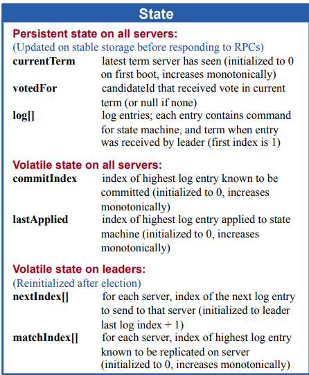
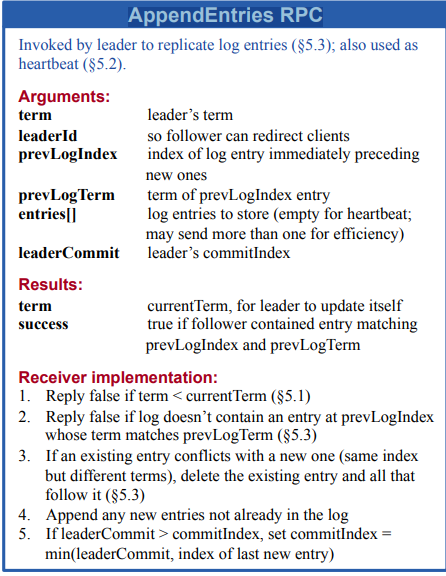
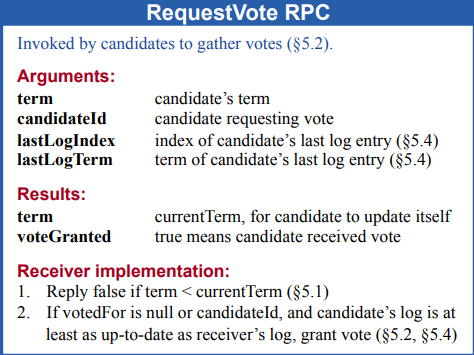
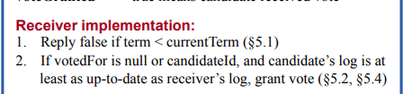
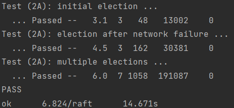
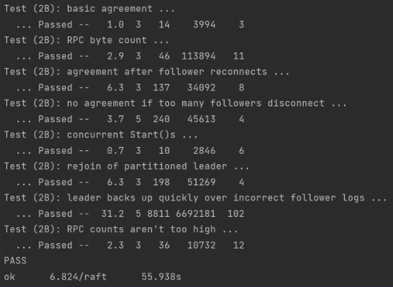

# 目录
<!-- @import "[TOC]" {cmd="toc" depthFrom=1 depthTo=6 orderedList=false} -->

<!-- code_chunk_output -->

- [目录](#目录)
- [1 实验概述](#1-实验概述)
- [2 实验流程](#2-实验流程)
  - [2.1 LAB2 A：领导选举](#21-lab2-a领导选举)
    - [2.1.1 RAFT中结构体的实现](#211-raft中结构体的实现)
      - [**状态机的定义**](#状态机的定义)
      - [LogEntry日志实体结构体的定义](#logentry日志实体结构体的定义)
      - [raft结构体定义](#raft结构体定义)
      - [AppendEntries RPC结构体的定义](#appendentries-rpc结构体的定义)
      - [RequestVote RPC结构体的定义](#requestvote-rpc结构体的定义)
    - [2.1.2 实现领导选举](#212-实现领导选举)
      - [步骤一：初始化raft节点](#步骤一初始化raft节点)
      - [步骤二：实现LEADER的心跳功能](#步骤二实现leader的心跳功能)
      - [步骤三：投票RPC功能的实现](#步骤三投票rpc功能的实现)
    - [2.1.3 实现LEADER心跳机制](#213-实现leader心跳机制)
  - [2.2 实现日志增量Logs Duplication](#22-实现日志增量logs-duplication)
    - [2.2.1 Start函数的实现](#221-start函数的实现)
    - [2.2.2 初始化Raft节点](#222-初始化raft节点)
    - [2.2.3 执行ticker函数](#223-执行ticker函数)
    - [2.2.4 构造日志同步RPC](#224-构造日志同步rpc)
    - [2.2.5 处理日志同步](#225-处理日志同步)
- [实验结果](#实验结果)

<!-- /code_chunk_output -->


# 1 实验概述

&emsp;&emsp;对于Lab2的A，B两部分实验内容分别是 RAFT 的**领导选举 LEADER ELECTION** 和 **状态机的复制 STATE DUPLICATION**

&emsp;&emsp;对于Lab2的A，一开始需要通过`Make`函数创建一个RAFT实例，同时新起一条goroutine来执行后台时钟，触发不同的事件。在实现领导选举的同时还要实现LEADER的心跳功能。具体而言，其中调用的测试func分别为`TestInitialElection2A`、`TestReElection2A`、`TestManyElections2A`。而这三者方法的话会发现都调用了`make_config`方法。而这个方法也就是我们构造出RAFT节点的方法。值得一提的是，测试代码里面会调用`raft.go`中的`getState`方法，**判断你当前的任期和是否是领导人**。

&emsp;&emsp;对于Lab2的B，首先是CLIENT，写入数据到RAFT框架的LEADER的日志数组中，然后LEADER再把这条日志数据，发送各个SERVER节点。最后等半数的SERVER都同意更新后，LEADER再更新返回。这在CLIENT看来就是所有的RAFT节点组成了一个统一的状态机。

# 2 实验流程

## 2.1 LAB2 A：领导选举

### 2.1.1 RAFT中结构体的实现

#### **状态机的定义**

&emsp;&emsp;

&emsp;&emsp;由RAFT论文中对状态的定义，对于每个SERVER的状态内容有以下定义：

1. Status：描述当前SERVER处于FOLLOWER，CANDIDATE和LEADER的哪个阶段；
2. VoteState：描述当前SERVER在投票阶段所处的状态；
3. AppendEntriesState：描述当前SERVER在追加日志阶段所处的状态；
4. HeartBeatTimeout：LEADER向其他SERVER发送心跳的超时时间。


&emsp;&emsp;`raft.go`中可以加入以下结构体来满足对特定状态的记录要求：

```go
// Status that of node -> FLWR, CNDI, LDR
type Status int

// define the state of RAFT state machine
// 0 -> FOLLOWER
// 1 -> CANDIDATE
// 2 -> LEADER
const (
	STATUS_FLWR Status = iota
	STATUS_CNDI
	STATUS_LDR
)

// VoteState for 2A
type VoteState int

// define the VOTE state during LAB2A
const (
	NORMAL VoteState = iota //node running normally
	KILLED        //node was compromised
	EXPIRE        //node timeout
	VOTED         //node voted during current term
)


// AppendEntriesState logs appended to LDR (2A 2B)
type AppendEntriesState int

// define the APPEND state during LAB2a
const (
	AppNormal    AppendEntriesState = iota // append successfully
	AppOutOfDate                           // append timeout
	AppKilled                              // RAFT node is dead
	AppRepeat                              // duplicate
	AppCommited                            // logs appended has been committed
	MisMatch                               // the index of logs appended are not matched
)

// HeartBeatTimeout global time set for hb timeout
var HeartBeatTimeout = 150 * time.Millisecond
```


#### LogEntry日志实体结构体的定义

&emsp;&emsp;LogEntry中包含当前日志对应的任期以及需要执行的指令集和。

```go
// LogEntry instruction set to exec, and the term of its current LDR
type LogEntry struct {
	Term int
	Command interface{}
}
```

#### raft结构体定义

```go
// Raft A Go object implementing a single Raft peer.
type Raft struct {
	mu        sync.Mutex          // Lock to protect shared access to this peer's state
	peers     []*labrpc.ClientEnd // RPC end points of all peers
	persister *Persister          // Object to hold this peer's persisted state
	me        int                 // this peer's index into peers[]
	dead      int32               // set by Kill()

	// Your data here (2A, 2B, 2C).
	// Look at the paper's Figure 2 for a description of what
	// state a Raft server must maintain.

	// Args that all servers MUST contain
	curTerm  int32
	votedFor int //CandidateID receiving vote
	log      []LogEntry

	// Args that all servers modify frequently
	lastCommit int //the MAX INDEX of a log that its node have committed, start from 0
	lastAppend int //the LAST INDEX of  a log APPENDED to a node BUT not committed yet

	// Args that ONLY LEADER has
	// cuz the number of servers is defined initially, we can use ARRAY to maintain
	// the next logs that leader should send to every server. the idx of array corresponds
	// to peers[].
	nextLogIdx  []int // the idx of next log leader will send to corresponding server
	matchLogIdx []int // the LATEST idx of log leader have sent

	// state -> Election state
	state int

	// timer -> 定时器
	timer *time.Ticker

	// rTimeout random timeout, 200 ~ 400 ms
	rTimeout time.Duration

	// appendLogs leader receive logs from client
	appendLogs chan ApplyMsg
}
```

#### AppendEntries RPC结构体的定义

&emsp;&emsp;`AppendEntries`这一结构体不仅实现了Lab2_B实验所需的 **日志增量同步**功能，而且还能为Lab2_A的LEADER节点实现心跳功能。当结构中的`entries[]`为空时就是LEADER向其他SERVER发出的心跳。

&emsp;&emsp;

&emsp;&emsp;具体定义如下：

```go
// AppendEntriesArgs definition
type AppendEntriesArgs struct {
	// Your data here (2A, 2B).
	Term         int
	LeaderId     int
	PreLogIndex  int
	PreLogTerm   int
	Entries      []LogEntry // logs prepared to be stored. AppendEntry is HeartBeat when it is empty
	LeaderCommit int
}

// AppendEntriesReply definition
type AppendEntriesReply struct {
	// Your data here (2A, 2B).
	Term     int				// leader的term可能是过时的，此时收到的Term用于更新他自己
	Checked  bool				//	如果follower与Args中的PreLogIndex/PreLogTerm都匹配才会接过去新的日志（追加），不匹配直接返回false
	AppState AppendEntriesState	// 追加的状态
	UpNextIndex int             //  用于更新请求节点的nextIndex[i]
}
```

#### RequestVote RPC结构体的定义

&emsp;&emsp;`RequestVote`这一结构体实现了CANDIDATE节点向其他FOLLOWER节点索取投票的功能，而FOLLOWER节点也可以根据当前的日志任期Term和日志下标Index来决定是否将票投给当前申请的CANDIDATE。

&emsp;&emsp;

&emsp;&emsp;具体定义如下：

```go
// RequestVoteArgs example RequestVote RPC arguments structure.
// field names must start with capital letters!
type RequestVoteArgs struct {
	// Your data here (2A, 2B).
	Term         int
	CandidateId  int
	LastLogIndex int
	LastLogTerm  int
}

// RequestVoteReply example RequestVote RPC reply structure.
// field names must start with capital letters!
type RequestVoteReply struct {
	// Your data here (2A).
	Term         int
	VotedGranted bool
	VState       VoteState
}
```

### 2.1.2 实现领导选举

#### 步骤一：初始化raft节点

&emsp;&emsp;通过`Make`方法来实现每个RAFT节点的状态。

```go
// Make the service or tester wants to create a Raft server. the ports
// of all the Raft servers (including this one) are in peers[]. this
// server's port is peers[me]. all the servers' peers[] arrays
// have the same order. persister is a place for this server to
// save its persistent state, and also initially holds the most
// recent saved state, if any. applyCh is a channel on which the
// tester or service expects Raft to send ApplyMsg messages.
// Make() must return quickly, so it should start goroutines
// for any long-running work.
func Make(peers []*labrpc.ClientEnd, me int,
	persister *Persister, applyCh chan ApplyMsg) *Raft {
	rf := &Raft{}
	rf.peers = peers
	rf.persister = persister
	rf.me = me

	// Your initialization code here (2A, 2B, 2C).
	rf.appendLogs = applyCh
	rf.state = STATUS_FLWR

	rf.curTerm = 0
	rf.votedFor = -1
	rf.log = make([]LogEntry, 0)

	rf.lastCommit = 0
	rf.lastAppend = 0

	rf.nextLogIdx = make([]int, len(peers))
	rf.matchLogIdx = make([]int, len(peers))

	rf.state = STATUS_FLWR
	rf.rTimeout = time.Duration(150+rand.Intn(200)) * time.Millisecond //设置Election Timeout随机时间 150 ~ 350 ms
	rf.timer = time.NewTicker(rf.rTimeout)

	// initialize from state persisted before a crash
	rf.readPersist(persister.ReadRaftState())

	// start ticker goroutine to start elections
	go rf.ticker()

	return rf
}
```

#### 步骤二：实现LEADER的心跳功能

&emsp;&emsp;每个RAFT节点都包含一个计时器timer，并且在初始化时通过随机设置时间间隔`time.Duration`来确定了本RAFT节点的超时时间。当一个RAFT节点在这个时间内没有收到任何来自邻近节点的**心跳AppendEntries**或者**投票申请VoteRequest**时，进行重新选举。如果出现两个RAFT节点的超时时间都是相同的间隔并且这两个节点同时超时，则系统将会再次重新选举LEADER。

&emsp;&emsp;具体实现如下：
```go
// The ticker go routine starts a new election if this peer hasn't received
// heartsbeats recently.
func (rf *Raft) ticker() {
	for rf.killed() == false {

		// Your code here to check if a leader election should
		// be started and to randomize sleeping time using
		// time.Sleep().
		select {

		case <-rf.timer.C:
			if rf.killed() {
				return
			}

			rf.mu.Lock()
			switch rf.state {
			case STATUS_FLWR:
				rf.state = STATUS_CNDI
				fallthrough

			case STATUS_CNDI:
				rf.curTerm++ //DIFF
				rf.votedFor = rf.me
				votedNums := 1 //统计当前本节点所获得的票数

				// 在每轮选举重新设置Election Timeout
				rf.rTimeout = time.Duration(150+rand.Intn(200)) * time.Millisecond
				rf.timer.Reset(rf.rTimeout)

				//向系统中其他节点发送VoteRequests申请获得票数
				for i := 0; i < len(rf.peers); i++ {
					if i == rf.me {
						continue
					}

					voteArgs := RequestVoteArgs{
						Term:         rf.curTerm,
						CandidateId:  rf.me,
						LastLogIndex: len(rf.log) - 1,
						LastLogTerm:  0,
					}
					if len(rf.log) > 0 {
						voteArgs.LastLogTerm = rf.log[len(rf.log)-1].Term
					}

					voteReply := RequestVoteReply{}

					go rf.sendRequestVote(i, &voteArgs, &voteReply, &votedNums)
				}

			case STATUS_LDR:
				// 进行心跳/日志同步
				appendNums := 1 // 对于正确返回的节点数量
				rf.timer.Reset(HeartBeatTimeout)
				// 构造msg
				for i := 0; i < len(rf.peers); i++ {
					if i == rf.me {
						continue
					}
					appendEntriesArgs := AppendEntriesArgs{
						Term:         rf.curTerm,
						LeaderId:     rf.me,
						PreLogIndex: 0,
						PreLogTerm:  0,
						Entries:      nil,
						LeaderCommit: rf.lastCommit,
					}

					appendEntriesReply := AppendEntriesReply{}
					//fmt.Printf("[	ticker(%v) ] : send a election to %v\n", rf.me, i)
					go rf.sendAppendEntries(i, &appendEntriesArgs, &appendEntriesReply, &appendNums)
				}
			}
		}

		rf.mu.Unlock()

		}
	}
}
```


#### 步骤三：投票RPC功能的实现

&emsp;&emsp;

&emsp;&emsp;根据RAFT论文的描述，CANDIDATE与FOLLOWER之间的任期Term和日志下标Index需要满足以下条件：
- 首先竞选者的任期必须，大于自己的任期。否则返回FALSE。因为在出先网络分区时，可能两个分区分别产生了两个LEADER。那么我们认为应该是任期长的LEADER拥有的数据更完整。
- 投票成功的前提的是，当前接收VoteRequests的FOLLOWER仍然没有投票，且CANDIDATE的日志状态要和当前FOLLOWER一致。

```go
func (rf *Raft) sendRequestVote(server int, args *RequestVoteArgs, reply *RequestVoteReply, cnt *int) bool {
	if rf.killed() {
		return false
	}

	ok := rf.peers[server].Call("Raft.RequestVote", &args, &reply)

	for !ok {
		// 失败重传
		if rf.killed() {
			return false
		}
		ok = rf.peers[server].Call("Raft.RequestVote", args, reply)

	}

	rf.mu.Lock()
	defer rf.mu.Unlock()
	//fmt.Printf("[	sendRequestVote(%v) ] : send a election to %v\n", rf.me, server)
	// 由于网络分区，请求投票的人的term的比自己的还小，不给予投票
	if args.Term < rf.curTerm {
		return false
	}

	// 对reply的返回情况进行分支处理
	switch reply.VState {
	// 消息过期有两种情况:
	// 1.是本身的term过期了比节点的还小
	// 2.是节点日志的条目落后于节点了
	case EXPIRE:
		{
			rf.state = STATUS_FLWR
			rf.timer.Reset(rf.rTimeout)
			if reply.Term > rf.curTerm {
				rf.curTerm = reply.Term
				rf.votedFor = -1
			}
		}
	case NORMAL, VOTED:
		//根据是否同意投票，收集选票数量
		if reply.VotedGranted && reply.Term == rf.curTerm && *cnt <= (len(rf.peers)/2) {
			*cnt++
		}

		// 票数超过一半
		if *cnt >= (len(rf.peers)/2)+1 {

			*cnt = 0
			// 本身就是leader在网络分区中更具有话语权的leader
			if rf.state == STATUS_LDR {
				return ok
			}

			// 本身不是leader，那么需要初始化nextIndex数组
			rf.state = STATUS_LDR
			rf.nextLogIdx = make([]int, len(rf.peers))
			for i, _ := range rf.nextLogIdx {
				rf.nextLogIdx[i] = len(rf.log) + 1
			}
			rf.timer.Reset(HeartBeatTimeout)
			//fmt.Printf("[	sendRequestVote-func-rf(%v)		] be a leader\n", rf.me)
		}
	case KILLED:
		return false
	}
	return ok
}
```


&emsp;&emsp;对于RAFT节点状态重置的时机本次实验中将其设置在`VoteRequests`方法内部，也就是在投票过程中进行。因为当进行`VoteRequests`的时候，基本情况下是先拉到多数票的RAFT节点成为第一个LEADER节点。 那么就可以在当前节点发起`VoteRequests` RPC的时候进行状态重置。因为先成为竞选者，先把自己的term就加一那么在一开始任期相同情况下该竞选者就会把其他RAFT节点进行重置。


&emsp;&emsp;具体实现如下所示

```go
// RequestVote:
// example RequestVote RPC handler.
func (rf *Raft) RequestVote(args *RequestVoteArgs, reply *RequestVoteReply) {
	// Your code here (2A, 2B).
	//defer fmt.Printf("[	    func-RequestVote-rf(%+v)		] : return %v\n", rf.me, reply)

	rf.mu.Lock()
	defer rf.mu.Unlock()

	// 当前节点crash
	if rf.killed() {
		reply.VState = KILLED
		reply.Term = -1
		reply.VotedGranted = false
		return
	}

	//reason: 出现网络分区，该竞选者已经OutOfDate(过时）
	if args.Term < rf.curTerm {
		reply.VState = EXPIRE
		reply.Term = rf.curTerm
		reply.VotedGranted = false
		return
	}

	if args.Term > rf.curTerm {
		// 重置自身的状态
		rf.state = STATUS_FLWR
		rf.curTerm = args.Term
		rf.votedFor = -1
	}

	//fmt.Printf("[	    func-RequestVote-rf(%+v)		] : rf.voted: %v\n", rf.me, rf.votedFor)
	// 此时比自己任期小的都已经把票还原
	if rf.votedFor == -1 {

		currentLogIndex := len(rf.log) - 1
		currentLogTerm := 0
		// 如果currentLogIndex下标不是-1就把term赋值过来
		if currentLogIndex >= 0 {
			currentLogTerm = rf.log[currentLogIndex].Term
		}

		//  If votedFor is null or candidateId, and candidate’s log is at least as up-to-date as receiver’s log, grant vote (§5.2, §5.4)
		// 论文里的第二个匹配条件，当前peer要符合arg两个参数的预期
		if args.LastLogIndex < currentLogIndex || args.LastLogTerm < currentLogTerm {
			reply.VState = EXPIRE
			reply.VotedGranted = false
			reply.Term = rf.curTerm
			return
		}

		// 给票数，并且返回true
		rf.votedFor = args.CandidateId

		reply.VState = NORMAL
		reply.Term = rf.currentTerm
		reply.VotedGranted = true

		rf.timer.Reset(rf.rTimeout)

		//fmt.Printf("[	    func-RequestVote-rf(%v)		] : voted rf[%v]\n", rf.me, rf.votedFor)

	} else { // 只剩下任期相同，但是票已经给了，此时存在两种情况

		reply.VState = VOTED
		reply.VotedGranted = false

		// 1、当前的节点是来自同一轮，不同竞选者的，但是票数已经给了(又或者它本身自己就是竞选者）
		if rf.votedFor != args.CandidateId {
			// 告诉reply票已经没了返回false
			return
		} else { // 2. 当前的节点票已经给了同一个人了，但是由于sleep等网络原因，又发送了一次请求
			// 重置自身状态
			rf.state = STATUS_FLWR
		}

		rf.timer.Reset(rf.rTimeout)

	}

	return
}
```

### 2.1.3 实现LEADER心跳机制

```go
func (rf *Raft) sendAppendEntries(server int, args *AppendEntriesArgs, reply *AppendEntriesReply, cnt *int) bool {
	if rf.killed() {
		return false
	}

	// paper中5.3节第一段末尾提到，如果append失败应该不断的retries ,直到这个log成功的被store
	ok := rf.peers[server].Call("Raft.AppendEntries", args, reply)
	for !ok {

		if rf.killed() {
			return false
		}
		ok = rf.peers[server].Call("Raft.AppendEntries", args, reply)

	}

	// 必须在加在这里否则加载前面retry时进入时，RPC也需要一个锁，但是又获取不到，因为锁已经被加上了
	rf.mu.Lock()
	defer rf.mu.Unlock()

	// 对reply的返回状态进行分支
	switch reply.AppState {

	// 目标节点crash
	case AppKilled:
		{
			return false
		}

	// 目标节点正常返回
	case AppNormal:
		{
			// 2A的test目的是让Leader能不能连续任期，所以2A只需要对节点初始化然后返回就好
			return true
		}

	//If AppendEntries RPC received from new leader: convert to follower(paper - 5.2)
	//reason: 出现网络分区，该Leader已经OutOfDate(过时）
	case AppOutOfDate:

		// 该节点变成追随者,并重置rf状态
		rf.state = STATUS_FLWR
		rf.votedFor = -1
		rf.timer.Reset(rf.rTimeout)
		rf.curTerm = reply.Term

	}
	return ok
}
```

```go
// AppendEntries
// which leader send to other servers
func (rf *Raft) AppendEntries(args *AppendEntriesArgs, reply *AppendEntriesReply) {
	// Your code here (2A, 2B).
	rf.mu.Lock()
	defer rf.mu.Unlock()

	// 节点crash
	if rf.killed() {
		reply.AppState = AppKilled
		reply.Term = -1
		reply.Checked = false
		return
	}

	// 出现网络分区，args的任期，比当前raft的任期还小，说明args之前所在的分区已经OutOfDate
	if args.Term < rf.curTerm {
		reply.AppState = AppOutOfDate
		reply.Term = rf.curTerm
		reply.Checked = false
		return
	}

	// 对当前的rf进行ticker重置
	rf.curTerm = args.Term
	rf.votedFor = args.LeaderId
	rf.state = STATUS_FLWR
	rf.timer.Reset(rf.rTimeout)

	// 对返回的reply进行赋值
	reply.AppState = AppNormal
	reply.Term = rf.curTerm
	reply.Checked = true
	return
}
```


## 2.2 实现日志增量Logs Duplication

&emsp;&emsp;Lab2_B这一实验是通过调用`raft.go`中的`Start`函数来对LEADER节点写入Logs，之后通过各个RAFT节点中的massage channel协程不断检测来判断Logs是否Apply成功。

### 2.2.1 Start函数的实现

```go
func (rf *Raft) Start(command interface{}) (int, int, bool) {
	index := -1
	term := -1
	isLeader := true

	// Your code here (2B).

	if rf.killed() {
		return index, term, false
	}

	rf.mu.Lock()
	defer rf.mu.Unlock()

	// 如果不是leader，直接返回
	if rf.state != STATUS_LDR {
		return index, term, false
	}

	isLeader = true

	// 初始化日志条目。并进行追加
	appendLog := LogEntry{Term: int(rf.curTerm), Command: command}
	rf.log = append(rf.log, appendLog)
	index = len(rf.log)
	term = int(rf.curTerm)

	return index, term, isLeader
}
```

### 2.2.2 初始化Raft节点

&emsp;&emsp;对于初始化的话的操作，对于lab2a没太大的差别。

```go
func Make(peers []*labrpc.ClientEnd, me int,
	persister *Persister, applyCh chan ApplyMsg) *Raft {
	rf := &Raft{}
	rf.peers = peers
	rf.persister = persister
	rf.me = me

	// Your initialization code here (2A, 2B, 2C).
	rf.appendLogs = applyCh			//2B
	rf.state = STATUS_FLWR


	rf.curTerm = 0
	rf.votedFor = -1
	rf.log = make([]LogEntry, 0)

	rf.lastCommit = 0
	rf.lastAppend = 0

	rf.nextLogIdx = make([]int, len(peers))
	rf.matchLogIdx = make([]int, len(peers))

	rf.state = STATUS_FLWR
	rf.rTimeout = time.Duration(150+rand.Intn(200)) * time.Millisecond //设置Election Timeout随机时间 150 ~ 350 ms
	rf.timer = time.NewTicker(rf.rTimeout)

	// initialize from state persisted before a crash
	rf.readPersist(persister.ReadRaftState())
	
	//fmt.Printf("[ 	Make-func-rf(%v) 	]:  %v\n", rf.me, rf.rTimeout)
	// start ticker goroutine to start elections
	go rf.ticker()

	return rf
}
```

### 2.2.3 执行ticker函数

&emsp;&emsp;根据各个RAFT节点的定时器以及当前自身所处的状态来决定是否开始新一轮的选举或者日志同步。

```go
func (rf *Raft) ticker() {
	for rf.killed() == false {

		// Your code here to check if a leader election should
		// be started and to randomize sleeping time using
		// time.Sleep().

		//计时器超时则进行选举
		select {

		case <-rf.timer.C:
			if rf.killed() {
				return
			}

			rf.mu.Lock()

			//根据当前raft节点所处状态进行对应的ticker操作
			switch rf.state {

			//如果本节点处于FOLLOWER的情况下选举超时
			case STATUS_FLWR:
				//则本节点状态变成CANDIDATE，并且fallthrough进行CANDIDATE对应的操作
				rf.state = STATUS_CNDI
				fallthrough

			case STATUS_CNDI:
				rf.curTerm++        //初始化自身的任期
				rf.votedFor = rf.me //投票给自己
				votedNums := 1      //统计当前本节点所获得的票数

				// 在每轮选举重新设置Election Timeout
				rf.rTimeout = time.Duration(150+rand.Intn(200)) * time.Millisecond
				rf.timer.Reset(rf.rTimeout)

				//向系统中其他节点发送VoteRequests申请获得票数
				for i := 0; i < len(rf.peers); i++ {
					if i == rf.me {
						continue
					}

					voteArgs := RequestVoteArgs{
						Term:         int(rf.curTerm),
						CandidateId:  rf.me,
						LastLogIndex: len(rf.log),
						LastLogTerm:  0,
					}
					if len(rf.log) > 0 {
						voteArgs.LastLogTerm = rf.log[len(rf.log)-1].Term
					}

					voteReply := RequestVoteReply{}

					go rf.sendRequestVote(i, &voteArgs, &voteReply, &votedNums)
				}

			case STATUS_LDR:
				// 进行心跳/日志同步
				appendNums := 1 // 对于正确返回的节点数量
				rf.timer.Reset(HeartBeatTimeout)
				// 构造msg
				for i := 0; i < len(rf.peers); i++ {
					if i == rf.me {
						continue
					}
					appendEntriesArgs := AppendEntriesArgs{
						Term:         int(rf.curTerm),
						LeaderId:     rf.me,
						PreLogIndex:  0,
						PreLogTerm:   0,
						Entries:      nil,
						LeaderCommit: rf.lastCommit, // lastCommit为大多数日志所对应的已提交的日志下标
					}

					appendEntriesReply := AppendEntriesReply{}

					// 如果nextIndex[i]长度不等于rf.logs,代表与leader的log entries不一致，需要附带过去
					appendEntriesArgs.Entries = rf.log[rf.nextLogIdx[i]-1:]

					// 代表已经不是初始值0
					if rf.nextLogIdx[i] > 0 {
						appendEntriesArgs.PreLogIndex = rf.nextLogIdx[i] - 1
					}

					if appendEntriesArgs.PreLogIndex > 0 {
						//fmt.Println("len(rf.log):", len(rf.log), "PreLogIndex):", args.PreLogIndex, "rf.nextLogIdx[i]", rf.nextLogIdx[i])
						appendEntriesArgs.PreLogTerm = rf.log[appendEntriesArgs.PreLogIndex-1].Term
					}

					//fmt.Printf("[	ticker(%v) ] : send a election to %v\n", rf.me, i)
					go rf.sendAppendEntries(i, &appendEntriesArgs, &appendEntriesReply, &appendNums)
				}
			}
		}

		rf.mu.Unlock()

	}
}
```

### 2.2.4 构造日志同步RPC

```go
// AppendEntries
// which leader send to other servers
func (rf *Raft) AppendEntries(args *AppendEntriesArgs, reply *AppendEntriesReply) {
	// Your code here (2A, 2B).
	rf.mu.Lock()
	defer rf.mu.Unlock()

	// 节点crash
	if rf.killed() {
		reply.AppState = AppKilled
		reply.Term = -1
		reply.Checked = false
		return
	}

	// 2A -> 出现网络分区，args的任期，比当前raft的任期还小，说明args之前所在的分区已经OutOfDate
	if args.Term < int(rf.curTerm) {
		reply.AppState = AppOutOfDate
		reply.Term = int(rf.curTerm)
		reply.Checked = false
		return
	}

	// 2B -> 出现conflict的情况
	// paper:Reply false if log doesn’t contain an entry at prevLogIndex,whose term matches prevLogTerm (§5.3)
	// 首先要保证自身len(rf)大于0否则数组越界
	// 1、 如果preLogIndex的大于当前日志的最大的下标说明跟随者缺失日志，拒绝附加日志
	// 2、 如果preLog出`的任期和preLogIndex处的任期和preLogTerm不相等，那么说明日志存在conflict,拒绝附加日志
	if args.PreLogIndex > 0 && (len(rf.log) < args.PreLogIndex || rf.log[args.PreLogIndex-1].Term != args.PreLogTerm) {

		reply.AppState = MisMatch
		reply.Term = int(rf.curTerm)
		reply.Checked = false
		reply.UpNextIndex = rf.lastAppend + 1
		return
	}

	// 如果当前节点提交的Index比传过来的还高，说明当前节点的日志已经超前,需返回过去
	if args.PreLogIndex != -1 && rf.lastAppend > args.PreLogIndex {
		reply.AppState = AppCommitted
		reply.Term = int(rf.curTerm)
		reply.Checked = false
		reply.UpNextIndex = rf.lastAppend + 1
		return
	}

	// 对当前的rf进行ticker重置
	rf.curTerm = int32(args.Term)
	rf.votedFor = args.LeaderId
	rf.state = STATUS_FLWR
	rf.timer.Reset(rf.rTimeout)

	// 对返回的reply进行赋值
	reply.AppState = AppNormal
	reply.Term = int(rf.curTerm)
	reply.Checked = true

	// 如果存在日志包那么进行追加
	if args.Entries != nil {
		rf.log = rf.log[:args.PreLogIndex]
		rf.log = append(rf.log, args.Entries...)

	}

	// 将日志提交至与Leader相同
	for rf.lastAppend < args.LeaderCommit {
		rf.lastAppend++
		applyMsg := ApplyMsg{
			CommandValid: true,
			CommandIndex: int32(rf.lastAppend),
			Command:      rf.log[rf.lastAppend-1].Command,
		}
		rf.appendLogs <- applyMsg
		rf.lastCommit = rf.lastAppend
		//fmt.Printf("[	AppendEntries func-rf(%v)	] commitLog  \n", rf.me)
	}

	return
}
```

### 2.2.5 处理日志同步

```go
func (rf *Raft) sendAppendEntries(server int, args *AppendEntriesArgs, reply *AppendEntriesReply, cnt *int) {
	if rf.killed() {
		return
	}

	// paper中5.3节第一段末尾提到，如果append失败应该不断的retries ,直到这个log成功的被store
	ok := rf.peers[server].Call("Raft.AppendEntries", args, reply)
	for !ok {

		if rf.killed() {
			return
		}
		ok = rf.peers[server].Call("Raft.AppendEntries", args, reply)

	}

	// 必须在加在这里否则加载前面retry时进入时，RPC也需要一个锁，但是又获取不到，因为锁已经被加上了
	rf.mu.Lock()
	defer rf.mu.Unlock()

	// 对reply的返回状态进行分支
	switch reply.AppState {

	// 目标节点crash
	case AppKilled:
		{
			return
		}

	// 目标节点正常返回
	case AppNormal:
		{
			// 2A的test目的是让Leader能不能连续任期，所以2A只需要对节点初始化然后返回就好
			// 2B需要判断返回的节点是否超过半数commit，才能将自身commit
			if reply.Checked && reply.Term == int(rf.curTerm) && *cnt <= len(rf.peers)/2 {
				*cnt++
			}

			// 说明返回的值已经大过了自身数组
			if rf.nextLogIdx[server] > len(rf.log)+1 {
				return
			}
			rf.nextLogIdx[server] += len(args.Entries)
			if *cnt > len(rf.peers)/2 {
				// 保证幂等性，不会提交第二次
				*cnt = 0

				if len(rf.log) == 0 || rf.log[len(rf.log)-1].Term != int(rf.curTerm) {
					return
				}

				for rf.lastAppend < len(rf.log) {
					rf.lastAppend++
					applyMsg := ApplyMsg{
						CommandValid: true,
						Command:      rf.log[rf.lastAppend-1].Command,
						CommandIndex: int32(rf.lastAppend),
					}
					rf.appendLogs <- applyMsg
					rf.lastCommit = rf.lastAppend
					//fmt.Printf("[	sendAppendEntries func-rf(%v)	] commitLog  \n", rf.me)
				}

			}
			//fmt.Printf("[	sendAppendEntries func-rf(%v)	] rf.log :%+v  ; rf.lastAppend:%v\n",
			//	rf.me, rf.logs, rf.lastApplied)
			return
		}

	case MisMatch:
		if args.Term != int(rf.curTerm) {
			return
		}
		rf.nextLogIdx[server] = reply.UpNextIndex
	//If AppendEntries RPC received from new leader: convert to follower(paper - 5.2)
	//reason: 出现网络分区，该Leader已经OutOfDate(过时）
	case AppOutOfDate:

		// 该节点变成追随者,并重置rf状态
		rf.state = STATUS_FLWR
		rf.votedFor = -1
		rf.timer.Reset(rf.rTimeout)
		rf.curTerm = int32(reply.Term)

	case AppCommitted:
		if args.Term != int(rf.curTerm) {
			return
		}
		rf.nextLogIdx[server] = reply.UpNextIndex
	}
	return
}
```

# 实验结果

&emsp;&emsp;所有test用例全部通过

&emsp;&emsp;
&emsp;&emsp;