# 一。 区间和问题：前缀和，树状数组与线段树

## 前缀和问题

### 303.  一维数组前缀和


**数学思想：**

$$
sumRange(i,j)=
\sum_{k=i}^{j}{nums[k]}\\
=\sum_{k=0}^{j}{nums[k]}-\sum_{k=0}^{i}{nums[k]}
$$

```c++
    class NumArray {
    private:
        int* sum;
    public:

        NumArray(vector<int>& nums) {
            int len=nums.size();
            sum=new int[len+1];
            sum[0]=0;						//方便后续计算
            for(int i=1;i<len;i++){
                sum[i+1]=sum[i]+nums[i];
            }
        }

        int sumRange(int left, int right) {
            return sum[right+1]-sum[left];
        }
    };
```


### [396.旋转数组](https://leetcode-cn.com/problems/rotate-function/)

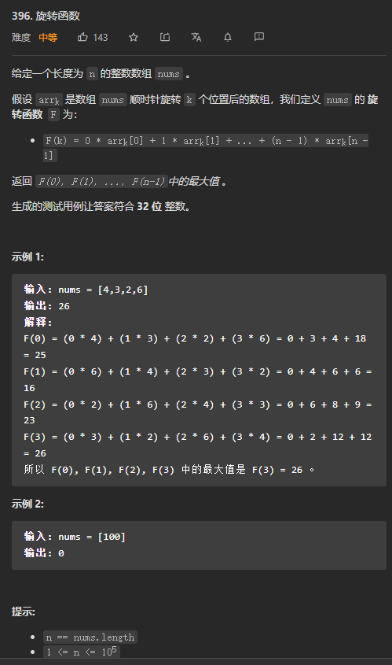

方法一：迭代
思路

记数组 $\textit{nums}$ 的元素之和为 $\textit{numSum}$。根据公式，可以得到：

F(0) = 0 $\times \textit{nums}[0]$ + 1 $\times \textit{nums}[1]$ + $\ldots$ + (n-1) $\times \textit{nums}[n-1]$

F(1) = 1 $\times \textit{nums}[0]$ + 2 $\times \textit{nums}[1]$ + $\ldots$ + 0 $\times \textit{nums}[n-1]$ = F(0) + $\textit{numSum}$ - n $\times \textit{nums}[n-1]$

更一般地，当 1 $\le k \lt n1≤k<n$ 时，F(k) = F(k-1) + $\textit{numSum}$ - n $\times \textit{nums}[n-k]$。我们可以不停迭代计算出不同的 F(k)，并求出最大值。

```c++
class Solution {
public:
    int maxRotateFunction(vector<int>& nums) {
        int sum = 0;
        int ans = 0;
        int size  = nums.size();
        int ptr = 0;
        int tmp_ans = 0;
        for(auto& a : nums)
        {
            sum += a;
        }

        for(int i = ptr ; i < size ; ++i)
        {
            ans += nums[i] * i;
        }
        
        ptr = (ptr+1)%size;

        tmp_ans = ans;

        while(ptr!=0)
        {
            tmp_ans = tmp_ans + sum - size * nums[size - ptr] ;
            ans = tmp_ans > ans ? tmp_ans : ans;
            ptr = (ptr+1)%size;
        }
        return ans;


    }
};
```

### [304.  二维数组前缀和](https://leetcode.cn/problems/range-sum-query-2d-immutable/)


```c++
class NumMatrix {
private:
    vector<vector<int>> sum;
public:
    NumMatrix(vector<vector<int>>& matrix) {
        int col=matrix[0].size();
        int row=matrix.size();
        sum.resize(row+1,vector<int>(col+1));        //自动全为零
        for(int i=0;i<row;i++){
            for(int j=0;j<col;j++){
                sum[i+1][j+1]=sum[i][j+1]+sum[i+1][j]+matrix[i][j]-sum[i][j];
            }
        }
    }
  
    int sumRegion(int row1, int col1, int row2, int col2) {
        return sum[row2+1][col2+1]-sum[row1][col2+1]-sum[row2+1][col1]+sum[row1][col1];		//与一维前缀和不同
    }
};
```

### [363.  矩形区域不超过K的最大数值和](https://leetcode.cn/problems/max-sum-of-rectangle-no-larger-than-k/)


```c++
class Solution {
public:
    int maxSumSubmatrix(vector<vector<int>>& matrix, int ptr) {
        vector<int> cur;
        //vector<int> sum((int)matrix[0].size(), 0);
        set<int> sum;

        int row = (int)matrix.size();
        int col = (int)matrix[0].size();

        int ans = INT_MIN;
        for(int i = 0; i < row; ++i){
            //这一段是在每一层生成对应的矩阵前缀和。过于繁琐，
            //可以一开始生成整体矩阵的二维前缀和之后
            //以o(n)的时间代价求出当前层的前缀和一维数组
            cur.clear();
            cur = matrix[i];
            for(int j = i ; j < row; ++j){
                if(j != i){
                    for(int k = 0; k < col; ++k){
                        cur[k] += matrix[j][k];
                    }
                }

                //生成当前前缀和
                sum.clear();
                int c_sum = 0;
                sum.insert(0);
                for(int k = 1; k <= col; ++k){
                    c_sum += cur[k - 1];
                    set<int>::iterator it = sum.lower_bound(c_sum - ptr);
                    if(it != sum.end()){
                        //cout<<"j:"<<j<<"   k:"<<k<<"   c_sum:"<<c_sum<<"   it:"<<(*it)<<endl;
                        ans = c_sum - (*it) > ans ? c_sum - (*it) : ans;
                    }
                    sum.insert(c_sum);
                }
            }
        }

        return ans;
    }
};
```

## 树状数组问题

**特征：** 数组内元素经常发生变化，需要不停改变前缀和的值，因此将顺序的前缀和拆分成 ==*二叉树*== 的形式，减少更改sum数组元素所需的开销。

- 定义树状数组
  

  sum[]数组元素的下标通过lowbit(int idx)函数来确定

  

- 更新。插入元素
    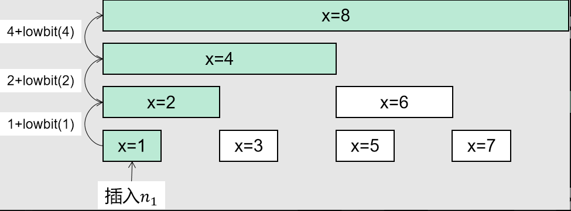

    使用lowbit累加，得到sum中的下标$idx$，也就是 ==**得到nums[]数组中对应的元素应该存放在sum[]数组中的什么位置**==

- 求区间和
  区间和是通过两个前缀和相减得到的值
  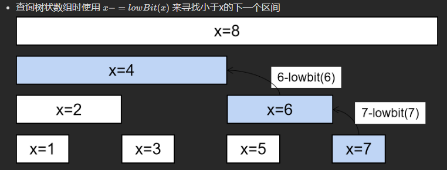

### [307. 区域和检索 - 数组可修改](https://leetcode.cn/problems/range-sum-query-mutable/)

```c++
class NumArray {
private:
    int * sum;
    vector<int> lcnumS;

    int size;

    int lowbit(int x)
    {
        return x & -x;
    }


    //更新某一节点的值
    void insert(int idx , int val)
    {
        //从下往上求和
        while(idx <= size)
        {
            sum[idx] += val;
            idx += lowbit(idx);
        }
    }

    //查询区间和
    int query(int idx)
    {
        int s = 0;
        while(idx > 0)
        {
            s += sum[idx];
            idx -= lowbit(idx);
        }
        return s;
    }

public:
    NumArray(vector<int>& nums) {
        size = nums.size();
        //前缀和数组元素个数比初始数组元素多一个
        sum = new int[size + 1];
        memset(sum,0,sizeof(int)*(size+1));
        for(auto tar : nums)
        {
            lcnumS.push_back(tar);
        }
        for(int i = 0 ; i < size ; ++i)
        {
            int idx = i + 1;
            insert(idx,nums[i]);
        }
    }
    
    void update(int index, int val) {
        int offset = val - lcnumS[index];
        int idx = index + 1;
        insert(idx,offset);
        lcnumS[index] = val;
    }
    
    int sumRange(int left, int right) {
        return query(right+1) - query(left);
    }
};

/**
 * Your NumArray object will be instantiated and called as such:
 * NumArray* obj = new NumArray(nums);
 * obj->update(index,val);
 * int param_2 = obj->sumRange(left,right);
 */
```


## 正整数+零混合数组的前缀和与二分查找的结合

**适用范围**：求数组的 ==**连续**子序列== 问题，要求**子序列的和**满足一定条件。

**思路**：求出数列的前缀和后，因为是==自然数==数组，其前缀和必然是**单调增数组**，因此可以使用**二分查找**来以$o(logN)$的时间代价获得满足条件的连续子序列的前端位置。

### [剑指offer.008 和大于等于target的最短子数组](https://leetcode.cn/problems/2VG8Kg/)

```c++
class Solution {
public:
    int minSubArrayLen(int target, vector<int>& nums) {
        int n_size = (int)nums.size();

        vector<int> sums(n_size + 1, 0);
        for(int i = 1; i <= n_size; ++i){
            sums[i] = sums[i - 1] + nums[i - 1];
        }

        int ans = INT_MAX;

        for(int i = 0 ; i < n_size; ++i){
            int le = i + 1;
            int ri = n_size;
            while(le < ri){
                int mid = (le + ri) >> 1;
                if(sums[mid] - sums[i] < target){
                    le = mid + 1;
                }else{
                    ri = mid;
                }
            }
            if(sums[le] - sums[i] < target){
                continue;
            }else{
                ans = ans > (le - i) ? le - i : ans;
            }
        }

        return ans == INT_MAX ? 0 : ans;
    }
};
```


## 正负整数混合数组的前缀和与哈希表的结合

**适用范围**：也是要求 ==**连续**子序列== 满足一定条件，但此时数组中出现==负数==。

**思路**：数组中出现==负数==，因此前缀和**不满足单调增**这一特性，二分查找无法进行。此时我们使用 ==**哈希表**== 这一数据结构来保存前面统计过的前缀和，在$o(1)$代价下直接获得满足条件的子数组前端位置。


### [剑指offer.011 0和1个数相同的子数组](https://leetcode.cn/problems/A1NYOS/)

```c++
class Solution {
public:
    int findMaxLength(vector<int>& nums) {
        int n_size = (int)nums.size();


        int ans = 0;
        int pre = 0;
        //int pre_one = 0;

        unordered_map<int, int> mp;     //对应的值--下标
        mp[0] = 0;

        for(int i = 1; i <= n_size ; ++i){
            pre += (nums[i - 1] == 0 ? -1 : 1);
            if(mp.find(pre) != mp.end()){
                ans = i - mp[pre] > ans ? i - mp[pre] : ans;
            }else{
                mp[pre] = i;
            }
            
        }

        return ans;
    }
};
```


## 线段树

### [729.我的日程安排I](https://leetcode.cn/problems/my-calendar-i/)

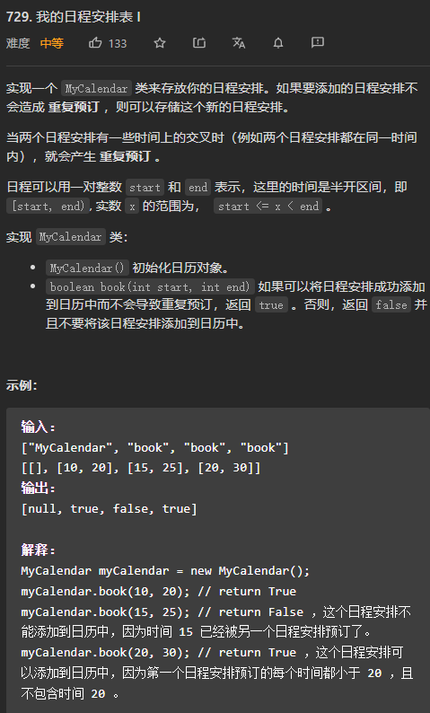

```c++
class MyCalendar {
private:
    unordered_map<int, int> tree;
    unordered_map<int, int> lazy;
    const int UP = 1e9 + 2;

    void pushdown(int len, int node) {
        if(lazy[node] != 0) {
            int le_node = node << 1;
            int ri_node = node << 1 | 1;
            lazy[le_node] = lazy[node];
            lazy[ri_node] = lazy[node];
            tree[le_node] = len - len / 2;
            tree[ri_node] = len / 2;
            lazy[node] = 0;
        }
    }


    void update(const int& start, const int& end, int L, int R, int node) {
        if(L >= start && R <= end) {
            lazy[node] = 1;
            tree[node] = R - L + 1;
            return;
        }
        int len = R - L + 1;
        pushdown(len, node);
        int mid = (L + R) >> 1;
        int le_node = node << 1;
        int ri_node = node << 1 | 1;

        if(start <= mid) {
            update(start, end, L, mid, le_node);
        }
        if(mid < end) {
            update(start, end, mid + 1, R, ri_node);
        }

        //pushup
        tree[node] = tree[le_node] + tree[ri_node];
    }

    bool query(const int& start, const int& end, int L, int R, int node) {
        if(L >= start && R <= end) {
            if(tree[node] != 0) {
                return false;
            }else {
                return true;
            }
        }
        int len = R - L + 1;
        pushdown(len, node);
        int mid = (L + R) >> 1;
        int le_node = node << 1;
        int ri_node = node << 1 | 1;

        bool tmp = true;

        if(start <= mid) {
            tmp = tmp && query(start, end, L, mid, le_node);
        }
        if(mid < end) {
            tmp = tmp && query(start, end, mid + 1, R, ri_node);
        }

        //pushup
        //不需要向上传递左右子节点的数值，因为并不清楚start与end是否与左右节点有交集
        //tree[node] = tree[le_node] + tree[ri_node];

        return tmp;
    }

public:
    MyCalendar() {

    }
    
    bool book(int start, int end) {
        if(query(start, end - 1, 0, UP, 1)) {
            update(start, end - 1, 0, UP, 1);
            return true;
        }else {
            return false;
        }
    }
};

/**
 * Your MyCalendar object will be instantiated and called as such:
 * MyCalendar* obj = new MyCalendar();
 * bool param_1 = obj->book(start,end);
 */
```

**注意事项：**
1. C++使用unordered_map模拟线段树的节点**如果数据量过高**（超过$10^5$）会出现TLE，除非预估线段树节点个数然后直接new一个大数组。
2. 建议使用Java动态开点。

JAVA动态开点算法：
```java
class MyCalendar {
    class Node {
        // ls 和 rs 分别代表当前节点的左右子节点在 tr 的下标
        // val 代表当前节点有多少数
        // add 为懒标记
        int ls, rs, add, val;
    }
    int N = (int)1e9, M = 120010, cnt = 1;
    Node[] tr = new Node[M];
    void update(int u, int lc, int rc, int l, int r, int v) {
        if (l <= lc && rc <= r) {
            tr[u].val += (rc - lc + 1) * v;
            tr[u].add += v;
            return ;
        }
        lazyCreate(u);
        pushdown(u, rc - lc + 1);
        int mid = lc + rc >> 1;
        if (l <= mid) update(tr[u].ls, lc, mid, l, r, v);
        if (r > mid) update(tr[u].rs, mid + 1, rc, l, r, v);
        pushup(u);
    }
    int query(int u, int lc, int rc, int l, int r) {
        if (l <= lc && rc <= r) return tr[u].val;
        lazyCreate(u);
        pushdown(u, rc - lc + 1);
        int mid = lc + rc >> 1, ans = 0;
        if (l <= mid) ans = query(tr[u].ls, lc, mid, l, r);
        if (r > mid) ans += query(tr[u].rs, mid + 1, rc, l, r);
        return ans;
    }
    void lazyCreate(int u) {
        if (tr[u] == null) tr[u] = new Node();
        if (tr[u].ls == 0) {
            tr[u].ls = ++cnt;
            tr[tr[u].ls] = new Node();
        }
        if (tr[u].rs == 0) {
            tr[u].rs = ++cnt;
            tr[tr[u].rs] = new Node();
        }
    }
    void pushdown(int u, int len) {
        tr[tr[u].ls].add += tr[u].add; tr[tr[u].rs].add += tr[u].add;
        tr[tr[u].ls].val += (len - len / 2) * tr[u].add; tr[tr[u].rs].val += len / 2 * tr[u].add;
        tr[u].add = 0;
    }
    void pushup(int u) {
        tr[u].val = tr[tr[u].ls].val + tr[tr[u].rs].val;
    }
    public boolean book(int start, int end) {
        if (query(1, 1, N + 1, start + 1, end) > 0) return false;
        update(1, 1, N + 1, start + 1, end, 1);
        return true;
    }
}

```

## 珂朵莉数(Old-Driver Tree)

### [剑指offer II 074.合并区间](https://leetcode.cn/problems/SsGoHC/)

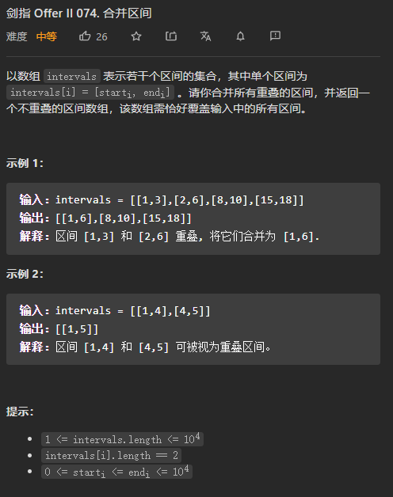

```c++
class Solution {
public:
    vector<vector<int>> merge(vector<vector<int>>& intervals) {
        //二分法查找大于当前遍历区间左端点的已存在区间的最小右端点。
        map<int, int> status;
        vector<vector<int>> ans;
        int size = intervals.size();
        for(int i = 0 ; i < size; ++i) {
            if(status.empty()) {
                status[intervals[i][1]] = intervals[i][0];
            }else {
                //统计当前合并区间的最大左右端点范围
                int front = intervals[i][0];
                int back = intervals[i][1];
                while(!status.empty()) {
                    auto it = status.lower_bound(intervals[i][0]);
                    if(it != status.end()) {
                        if(it->second <= intervals[i][1]) {
                            front = it->second < front ? it->second : front;
                            back = it->first > back ? it->first : back;
                            status.erase(it);
                            if(status.empty()) {
                                status[back] = front;
                                break;
                            }
                        }else {
                            status[back] = front;
                            break;
                        }
                    }else {
                        status[back] = front;
                        break;
                    }
                }

            }
        }
        for(auto& [back, front] : status) {
            ans.push_back(vector<int>{front, back});
        }

        return ans;
    }
};
```

### [715. Range模块](https://leetcode.cn/problems/range-module/)

**注意：**此题使用C++动态开点会出现==Time Limit Exceeded==，推荐使用Java。

```c++
class RangeModule {
private:
    // 也可以用 set<pair<int,int>>，但显然 map 更简洁一些
    // 注意 key 为 right，value 为 left，为了方便后面查找
    map<int, int> mp;

public:
    RangeModule() {
    }

    void addRange(int left, int right) {
        // l r 记录新区间的左右端点
        int l = left, r = right;
        // 找到第一个右端点大于等于 left 的区间，即第一个可能与要添加区间重合的的区间
        // 注意 key 为 right，value 为 left，也是为了这里方便查找
        auto p = mp.lower_bound(left);
        // 注意上面查找只保证找到的区间 右端点 大于目标区间左端点 left
        // 同时需要该区间 左端点 小于目标区间右端点 right，才能保证有重合，即 p->second <= right
        // 同时要时刻注意 map 的 key 即 first 是右端点，second 是左端点
        while (p != mp.end() && p->second <= right) {
            // 维护 [l, r] 为合并后的区间
            l = min(l, p->second);
            r = max(r, p->first);
            // 删除旧区间
            mp.erase(p++);
        }
        mp[r] = l;
        // 经过上面的操作，已经把有重合的区间合并为一个大区间
        // 注意，[1,2) 和 [2,3) 也能够被合并为 [1,3)，可以在纸上画一画
    }

    bool queryRange(int left, int right) {
        // 同上，找到第一个右端点大于等于 left 的区间，即第一个可能与要添加区间重合的的区间
        auto p = mp.lower_bound(left);
        // 没找到，false
        if (p == mp.end()) return false;
        // 找到了，因为我们的 addRange 方法保证了连续的区间都能被合并为一个大区间
        // 所以我们只要判断找到的区间是否大于等于目标区间即可，包含则 true，否则 false
        if (p->second <= left && p->first >= right) return true;
        return false;
    }

    void removeRange(int left, int right) {
        // 同上，找到第一个右端点大于等于 left+1 的区间，即第一个可能与要添加区间重合的的区间
        // 注意，移除 [2,3) 时，[1,2) 和其无交集，所以要找右端点大于等于 left+1 的区间
        auto p = mp.lower_bound(left + 1);
        // 同上
        while (p != mp.end() && p->second <= right) {
            // 如果找到的区间左侧有不用删除的部分，则加入到 map 中
            if (p->second < left) {
                mp[left] = p->second;
            }
            // 注意不包括等于
            if (p->first > right) {
                // 如果右端点大于 right，直接添加右边不用删除的部分即可
                // 注意由于 map 的 key 是右端点，所以这里是修改右端点对应的左端点
                mp[p->first] = right;
                // 由于我们保证连续的区间一定能合并为一个大区间，所以可以直接 break 了，不 break 后面也会调出循环
                break;
            } else {
                // 如果右端点小于 right，区间完全要被删除，map 移除该区间，往下查找
                mp.erase(p++);
            }
        }
    }
};
```

# 二。 连续子序列问题

## 普通数组子序列问题

### [300.最长递增子序列](https://leetcode.cn/problems/longest-increasing-subsequence/)

```c++
//动态规划可解
class Solution {
public:
    int lengthOfLIS(vector<int>& nums) {
        int n=nums.size();
        if(n==1) return 1;
        vector<int> f(n,0);
        for(int i=0;i<n;i++){
            int len=1;
            for(int j=0;j<i;j++){
                if(nums[j]<nums[i]){
                    if(f[j]+1>len){
                        len=f[j]+1;

                    }
                }
            }
            f[i]=len;
        }
    
        int index=max_element(f.begin(),f.end())-f.begin();
        return f[index];
    }
};
```

### [368.  最大整除子集](https://leetcode.cn/problems/largest-divisible-subset/)

```c++
class Solution {
public:
    vector<int> largestDivisibleSubset(vector<int>& nums) {
        int len=nums.size();
        if(len==0||len==1) return nums;
        vector<int> f(len,0);			//动态规划数组，f[i]表示以nums[i]为结束的最长整除子序列
        vector<int> g(len,0);			//回溯数组，用于输出序列
        sort(nums.begin(),nums.end());
        for(int i=0;i<len;i++){
            int lth=1;int prev=i;
            for(int j=0;j<i;j++){
                if(nums[i]%nums[j]==0){
                    if(f[j]+1>lth){
                        lth=f[j]+1;
                        prev=j;
                    }
                }
            }
            f[i]=lth;
            g[i]=prev;
        }


        int index=max_element(f.begin(),f.end())-f.begin();
        int max=f[index];

        vector<int> op;
        while(op.size()<max){
            op.push_back(nums[index]);
            index=g[index];
        }

        return op;
    }
};

```


## 循环数组子序列问题

### [918.环形数组子序列最大和](https://leetcode.cn/problems/maximum-sum-circular-subarray/)

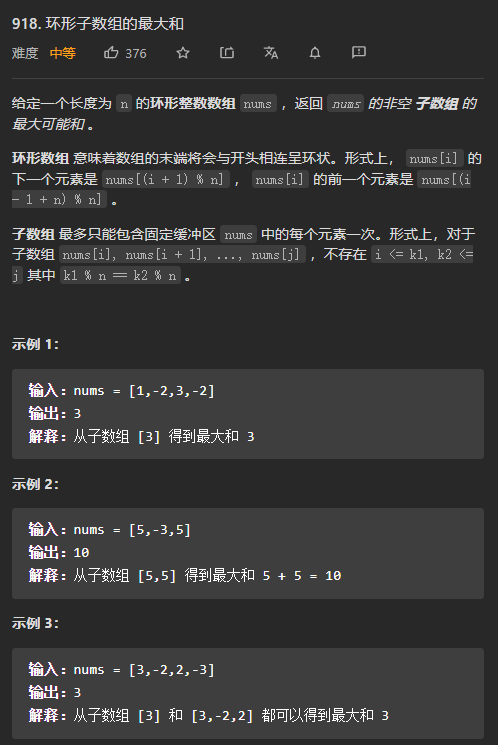

**思路**：

将问题分成两部分：

1. 数组作为普通数组时求最大连续子数组和；
2. 收尾相连时作为循环数组求最大和，此时问题可以转换为**求数组的最小连续子数组之和**，之后用该数组所有元素的和sum减去最小和min即可

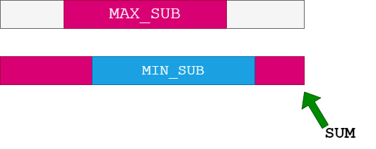

```Java
class Solution {
    private int max;
    private int min;
    private int[] sum;
    private int size;
    public int maxSubarraySumCircular(int[] nums) {
        size = (int)nums.length;
        sum = new int[size + 1];
        max = 0;
        min = 0;


        for(int i = 1; i <= size; ++i) {
            sum[i] = sum[i - 1] + nums[i - 1];
        }

        int cur_max = 0;
        int cur_min = 0;

        for(int i = 0; i < size; ++i) {
            if(cur_max + nums[i] > 0) {
                cur_max += nums[i];
                max = cur_max > max ? cur_max : max;
            }else cur_max = 0;


            if(cur_min + nums[i] < 0) {
                cur_min += nums[i];
                min = cur_min < min ? cur_min : min;
            }else {
                cur_min = 0;
            }
        }

        //System.out.println("max:" + max + "\tmin:" + min + "\tsum:" + sum[size]);
        if(sum[size] - min == 0 && max == 0) {
            int ans = -400005;
            for(int i = 0; i < size; ++i) {
                if(nums[i] > ans) {
                    ans = nums[i];
                }
            }
            return ans;
        }

        return sum[size] - min > max ? sum[size] - min : max;
    }
}
```


# 三。 图的遍历算法（DFS。BFS）

## [417.大西洋太平洋水流问题](https://leetcode-cn.com/problems/pacific-atlantic-water-flow/)

**特征**：使用 **==逆向==深度优先搜索**，从图的边界开始向内部搜索。$visit1[]$和$visit2[]$用来记录**从两个海岸线开始遍历**的已遍历过的节点。

```C++
class Solution {
private:
    int row;
    int col;
    int direction[5] = {-1,0,1,0,-1};
    vector<vector<int>> ans;
    void dfs(vector<vector<int>>& heights, vector<vector<int>>& mark, vector<vector<bool>>& visit, int row, int col)
    {
        if(visit[row][col] != false || row >= heights.size() || row < 0 || col >= heights[0].size() || col < 0)
        {
            return;
        }
        else
        {
            visit[row][col] = true;
            ++mark[row][col];
            for(int i = 0 ; i < 4 ; ++i)
            {
                if(row+direction[i] >= heights.size() || row+direction[i] < 0 || col+direction[i+1] >= heights[0].size() || col+direction[i+1] < 0) continue;
                if(heights[row][col] <= heights[row+direction[i]][col+direction[i+1]])
                {
                    dfs(heights,mark,visit,row+direction[i],col+direction[i+1]);
                }
                
            }
            return;
        }
    }
public:
    vector<vector<int>> pacificAtlantic(vector<vector<int>>& heights) {
        row = heights.size();
        col = heights[0].size();
        vector<vector<int>> mark(row,vector<int>(col,0));
        vector<vector<bool>> visit1(row,vector<bool>(col,false));
        vector<vector<bool>> visit2(row,vector<bool>(col,false));
        for(int i = 0 ; i < row ; ++i)
        {
            if(visit1[i][0] == false)
            {
                dfs(heights,mark,visit1,i,0);
            }
            if(visit2[i][col-1] == false)
            {
                dfs(heights,mark,visit2,i,col-1);
            }
        }
        for(int i = 0 ; i < col ; ++i)
        {
            if(visit1[0][i] == false)
            {
                dfs(heights,mark,visit1,0,i);
            }
            if(visit2[row-1][i] == false)
            {
                dfs(heights,mark,visit2,row-1,i);
            }
        }

        vector<int> tmp;
        for(int i = 0 ; i < row ; ++i)
        {
            for(int j = 0 ; j < col ; ++j)
            {
                if(mark[i][j] > 1)
                {
                    tmp.push_back(i);
                    tmp.push_back(j);
                    ans.push_back(tmp);
                    tmp.clear();
                }
            }
        }
        return ans;
    }
};
```

## [725. 打开转盘锁](https://leetcode-cn.com/problems/open-the-lock/)

```c++
class Solution {
private:
    unordered_set<string> deadNums;     //哈希表记录死亡数字
  
    unordered_set<string> seen;         //哈希表记录已经访问的数字避免重复访问

    queue<pair<string, int>> rcrd;

    char num_prev(char& a)
    {
        return a=='0'?'9':a-1;
    }

    char num_succ(char& a)
    {
        return a=='9'?'0':a+1;
    }

    vector<string> get(string init)
    {
        vector<string> ret;
        for(int i=0;i<4;++i)
        {
            char tmp=init[i];
            init[i]=num_prev(tmp);
            ret.push_back(init);
            init[i]=num_succ(tmp);
            ret.push_back(init);
            init[i]=tmp;
        }
        return ret;

    }

  

public:
    int openLock(vector<string>& deadends, string target) {
        deadNums.clear();
        seen.clear();
        seen.insert("0000");
        rcrd.emplace("0000",0);


        if(target=="0000") return 0;
        for(auto& str : deadends)
        {
            deadNums.insert(str);
        }
        if(deadNums.count("0000")) return -1;

        while(!rcrd.empty())
        {
            auto [tar, step] = rcrd.front();
            rcrd.pop();
            for(auto next_status : get(tar))
            {
                if(!seen.count(next_status)&&!deadNums.count(next_status))
                {
                    if(next_status==target)
                    {
                        return step+1;
                    }
                    rcrd.emplace(next_status, step+1);
                    seen.insert(move(next_status));
                }
            }
        }
        return -1;

    }
};
```

##  [127.单词接龙](https://leetcode-cn.com/problems/word-ladder/)


**单项BFS遍历**
```c++
class Solution {
private:
    unordered_set<string> dict;     //Hash字典，方便快速查找wordList中的单词
    int ans;                        //层数，也是返回值
    int size;                       //单词长度
    bool mark = false;              //标志位
public:
    int ladderLength(string beginWord, string endWord, vector<string>& wordList) {
        //将wordList中的单词加入Hash字典
        for(const auto & tar :wordList)
        {
            dict.insert(tar);
        }

        //先手判断是否能完成变换
        if(dict.count(endWord) == 0) return 0;


        size = beginWord.size();

        //建立队列存放当前bfs遍历层数
        queue<string> q;
        q.push(beginWord);

        //预处理
        //1. 将层数设置为0
        ans = 0;
        //2. 防止重复遍历，将已经遍历过的单词从dict中抹除
        dict.erase(beginWord);

        //开始遍历
        while(!q.empty())
        {
            ans++;                              //当前遍历的单词已经处于下一层的位置，所以层数ans直接+1
            
            //统计当前层的单词总数，一次遍历一层的全部节点
            int q_size = q.size();              
            for(int k = 0 ; k < q_size ; ++k)
            {
                const string curWord = q.front();   //当前节点，也是父节点
                q.pop();
                string neWord = curWord;            //下一层节点，也是子节点

                //按位替换单词中的字母
                for(int i = 0 ; i < size ; ++i)
                {
                    const char ptr = neWord[i];     //保存当前替换位的字母
                    for(char c = 'a' ; c <= 'z' ; ++c)
                    {
                        neWord[i] = c;              //替换之后形成新的单词
                        if(dict.count(neWord) == 0) continue;

                        //cout << neWord <<endl;
                        //cout << ans <<endl;

                        //到这一步时，neWord必然在dict字典中，进行进一步处理
                        //1. 从字典中抹除neWord
                        dict.erase(neWord);

                        //2. 如果neWor就是endWord则设置标志位为true
                        if(neWord == endWord) mark = true;

                        //3. 将neWord加入队列q，作为下一层遍历的对象
                        q.push(neWord);
                    }
                    neWord[i] = ptr;
                }
            }
            
            if(mark) break;
        }
        //判断结果
        if(mark) return ans + 1;
        else return 0;
    }
};
```

**双向BFS的遍历**

```c++
class Solution {
private:
    unordered_map<string,int> left;     //beginWord对应当前的层数
    queue<string> lq;

    unordered_map<string,int> right;    //endWord对应当前的层数
    queue<string> rq;
  
    unordered_set<string> wrdl;         //Hash字典存储wordList方便快速查找判断

    int len = beginWord.length();       //字母长度

    int update(queue<string>& q, unordered_map<string,int>& cur, unordered_map<string,int>& other)
    {
        string ptr = q.front();
        
        q.pop();

        for(int i = 0 ; i < len ; ++i)
        {
            string tmp = ptr;
            for(int j = 0 ; j < 26 ; ++j)
            {
                tmp[i] = 'a' + j ;
                if(wrdl.count(tmp))
                {
                    //当前方向已经遍历到该节点，直接跳过
                    if(cur.count(tmp)) continue;
                    
                    //另一方向中存在当前单词，则表明遍历结束，已经获得结果
                    if(other.count(tmp)) 
                    {
                        return other[tmp]+cur[ptr]+1;
                    }
                    else
                    {
                        //将当前单词入队
                        q.emplace(tmp);
                        //更新当前遍历方向的单词所在层数
                        cur[tmp]=cur[ptr]+1;
                    }
                }
            }
        }
        return -1;
    
    }


    int bfs()
    {
        while(!lq.empty()&&!rq.empty())
        {
            int mk=-1;
            if(lq.size()>rq.size())
            {
                mk=update(rq,right,left);
            }
            else
            {
                mk=update(lq,left,right);
            }
            if(mk!=-1) return mk;
        }
        return -1;
    }


public:
    int ladderLength(string bW, string eW, vector<string>& wordList) {
        left.clear();
        right.clear();
        wrdl.clear();
        for(auto& str : wordList)
        {
            wrdl.insert(str);
        }
        if(!wrdl.count(eW)) return 0;


        lq.emplace(bW);
        rq.emplace(eW);
        left[bW]=0;
        right[eW]=0;

        int ans=bfs();

    
        return ans==-1?0:ans+1;

    
    }
};
```

## [126. 单词接龙II](https://leetcode-cn.com/problems/word-ladder-ii/)

**特征：使用bfs遍历得到最短距离，使用dfs获得路径**

```c++
class Solution {
private:
    unordered_set<string> dict; //存储wordList,以便快速查找单词表
    unordered_map<string,int> lvl_map;  //存储每个单词对应的层数
    unordered_map<string,unordered_set<string>> drv_map ;   //key:目标单词 vec:单词列表，其中存储的单词可以变化为key也就是key's parents 
                                                            //反向记录路径  
    vector<vector<string>> ans; //返回值
public:
    vector<vector<string>> findLadders(string beginWord, string endWord, vector<string>& wordList) {
        //单词表加入Hash表中
        for(const auto & tar : wordList)
        {
            dict.insert(tar);
        }
        //若endWord不在单词表中则直接返回空值
        if(dict.count(endWord)==0) return ans;
        //为了防止重复遍历，每次将当前遍历到的单词从dict中抹除
        dict.erase(beginWord);

        //STEP 1:记录每个单词的当前遍历层数
        lvl_map[beginWord] = 0;

        int wordSize = beginWord.size();

        int lvl = 0;
        bool found = false;

        queue<string> q ;
        q.push(beginWord);
        while(!q.empty())
        {
            lvl++;
            int cur_lvl_size = q.size();
            for(int i = 0 ; i < cur_lvl_size ; ++i)
            {
                string curWord = q.front();
                string neWord = curWord;
                q.pop();
                
                for(int j = 0 ; j < wordSize ; ++j)
                {
                    const char ptr = neWord[j];
                    for(char c = 'a' ; c <= 'z' ; ++c)
                    {
                        neWord[j] = c;


                        //不同cur父单词通过字母变换得到相同的一个ne子单词
                        //因为在首次遍历到ne之后就将其从dict中移除，而仍然有其他的父单词cur可以通过变换得到ne子单词。
                        if(lvl_map[neWord] == lvl)
                        {
                            drv_map[neWord].insert(curWord);
                            //curWord不同情况下得到相同的ne
                        }


                        if(dict.count(neWord)==0)
                        {
                            continue;
                        }
                        //neWord存在于dict字典中，可以进行进一步处理
                        //去重，避免重复遍历
                        dict.erase(neWord);
                        //当前层入队
                        q.push(neWord);
                        //记录ne与cur的关系：ne子cur父
                        drv_map[neWord].insert(curWord);
                        //记录ne的lvl层数
                        lvl_map[neWord] = lvl;
                        //入队，记录完毕之后  判断ne是否已到末尾
                        if(neWord == endWord)
                        {
                            found = true;
                        }
                    }
                    //恢复原值
                    neWord[j] = ptr;
                }
            }
            //为什么在最外围break？
            //等待一轮bfs完全结束后才能得到最短距离
            if(found) break;
        }
        if(found)
        {
            vector<string> Path = {endWord};
            dfs(ans , endWord , drv_map , Path);
        }
        return ans;
    }

    void dfs(vector<vector<string>> &res, const string &Node, unordered_map<string, unordered_set<string>> &from, vector<string> &path)
    {
        if(from[Node].empty())
        {
            res.push_back({path.rbegin(),path.rend()});
            return;
        }
        else
        {
            for(const string& parent : from[Node])
            {
                path.push_back(parent);
                dfs(res,parent,drv_map,path);
                path.pop_back();
            }
        }
    }
};
```

## 403. 青蛙过河

**经典的错误**：记录重复的数据需要和queue中的数据构成一致

本体中判重的根据是**位置**和**跳到该位置的步数**

```c++
bool seen[2042][2042];        //下标，步数
class Solution {
private:
    queue<pair<int,int>> q;         //下标，步数
    unordered_map<int,int> se;      //位置
    bool bfs(vector<int> stones,int end)
    {
        q.emplace(make_pair(stones[0],0));
        seen[stones[0]][0]=true;
        while(!q.empty())
        {
            auto P = q.front();
            q.pop();
            int step = P.second;
            int idx = P.first;

            if (idx == end)
                return true;
            for(int i =-1;i<=1;i++)
            {
                int next_st = step+i;
                int next_pos = next_st + stones[idx];
                if(next_st<=0) continue;
                if(se.count(next_pos))
                {
                    int next_idx = se[next_pos];
                    if(next_idx==end) return true;
                    if(!seen[next_idx][next_st])
                    {
                        seen[next_idx][next_st]=true;
                        q.emplace(make_pair(next_idx,next_st));
                    }
                }
            }

        }
        return false;
    }


public:
    bool canCross(vector<int>& stones) {
        se.clear();
        memset(seen,0,sizeof(seen));
        int len = stones.size();
        for(int i = 0;i<len;i++)
        {
            se[stones[i]]=i;
        }
        int end = len-1;
        bool ans = bfs(stones,end);
        return ans;
    }
};
```

## 815. 公交路线

```c++
class Solution {
private:
    unordered_map <int,int> tarvisited;          //路线，步数
    queue<int> tarq;                                //路线

    unordered_map<int,unordered_set<int>> mk;    //位置，路线


public:
    int numBusesToDestination(vector<vector<int>>& routes, int source, int target) {
        int bus = routes.size();
        if(source==target) return 0;
        for(int i =0 ;  i<bus;++i)
        {
            for(auto tar : routes[i])
            {
                mk[tar].insert(i);
                if(tar==target)
                {
                    tarq.emplace(i);
                    tarvisited[i]=1;
                }
            }
        }
        while(!tarq.empty())
        {
            auto stat = tarq.front();
            tarq.pop();
            for(auto next_pos : routes[stat])
            {
                if(next_pos==source) return tarvisited[stat];
                for(auto next_stat : mk[next_pos])
                {
                    if(!tarvisited[next_stat])
                    {
                        tarq.emplace(next_stat);
                        tarvisited[next_stat]=tarvisited[stat]+1;
                    }
                }
            }
        }
        return -1;
    }
};
```

# 四。 单调栈

## 特点

1. 要求保持原来数据的**相对位置**;
2. 要求数据按照**非递增。非递减**等一定顺序排列

## [单调栈军训题](https://leetcode-cn.com/problems/remove-duplicate-letters/solution/yi-zhao-chi-bian-li-kou-si-dao-ti-ma-ma-zai-ye-b-4/)


## [84.柱状图中最大的矩形](https://leetcode-cn.com/problems/largest-rectangle-in-histogram/)

```c++
class Solution {
private:
    stack<int> wader;
    int ans = 0;
public:
    int largestRectangleArea(vector<int>& heights) {
        int len = heights.size();

        int left[len];
        for(int i = 0 ; i < len ; ++i)
        {
            left[i]=-1;
        }
        int right[len];
        for(int i = 0 ; i < len ; ++i)
        {
            right[i]=len-1;
        }
        //初始化


        wader.push(0);
        for(int i = 1 ; i < len ; ++i)
        {
            while(!wader.empty() && heights[i] < heights[wader.top()])
            {
                right[wader.top()] = i - 1;
                wader.pop();
            }
            left[i] = wader.empty()?-1:wader.top();
            wader.push(i);
        }

        for(int i = 0 ; i < len ; ++i)
        {
            ans = max(heights[i]*(right[i]-left[i]),ans);
        }
        return ans;
    }
};
```

## [316.去除重复字母](https://leetcode-cn.com/problems/remove-duplicate-letters/)

```c++
class Solution {
private:
    string ans;
    bool mark[128] = {false};       //是否访问
    int cnt[128] = {0};             //该字符是否为字符串中最后出现的字符
public:
    string removeDuplicateLetters(string s) {
        ans = "";
        if(s.size() == 1) return s;

        for(const auto& c : s)
        {
            cnt[c]++;
        }

        for(const auto& c : s)
        {
            //未访问过，可以将该字符加入单调栈
            if(!mark[c])    
            {
                //将栈顶元素与当前遍历到的字符比较，若字典序比当前字符大则进行进一步处理
                while(!ans.empty() && ans.back() > c)
                {
                    //如果栈顶元素并非该字符串s中所有相同字符中的最后一个，则可以弹出
                    if(cnt[ans.back()] > 0 )
                    {
                        //相应地，对应栈顶元素的访问标记置为false
                        mark[ans.back()] = 0;
                        ans.pop_back();
                    }
                    else
                        break;
                }
                mark[c] = true;
                ans.push_back(c);
            }

            //不要加else，无论是否遍历过都应该将计数-1，以此保证是单向选取元素（也就是不会回退）
            //已经遍历过了，只需要直接将计数-1
            cnt[c]--;
        }
        return ans;
    }
};
```

## [402.移除k位数字](https://leetcode-cn.com/problems/remove-k-digits/)

```c++
class Solution {
public:
    string removeKdigits(string num, int k) {
        string ans = "";
        if(k == num.size()) return "0";
        for(const char& c : num)
        {
            while(!ans.empty() && ans.back() > c && k)
            {
                ans.pop_back();
                k--;
            }
            ans.push_back(c);
        }
        int size = ans.size();
        if(k && k <= size)      //若需要移除的数个数k仍然存在，则直接抹除后面几位数字
        {
            ans.erase(size - k , k);
        }
        while(!ans.empty() && ans[0] == '0')
        {
            ans.erase(0,1);
        }
        if(ans.empty()) ans.push_back('0');

        return ans;
    }
};
```

# 五。 桶排序

## 220. 存在重复元素III

一般思路：用**有序集合**set保存**滑动窗口**内的数据，每次遍历到新的数则从set中取出**离下标$cur-t$最近的值**进行比较，如果该值处于$[cur-t,cur+t]$之间则返回true，若没有则将本次遍历到的数值加入set。

**如何保持滑动窗口**：如果$i-k>=0$，则set中存在**滑动窗口以外**的元素（也就是包括$nums[i-k]$之后的元素），需要erase。

```c++
#define LL long long
class Solution {
public:
    bool containsNearbyAlmostDuplicate(vector<int>& nums, int k, int t) {
        set<LL> srch;
        int n = nums.size();
        LL dec = t*1LL;
        for(int i = 0 ; i < n ; ++i)
        {
            LL cur = nums[i]*1LL;
            auto it = srch.lower_bound(cur-dec);
            if(it!=srch.end()&&abs((*it)-cur)<=dec) return 1;
            srch.insert(cur);
            if(i>=k)
            {
                LL del = nums[i-k]*1LL;
                srch.erase(del);
            }
        }
        return false;
    }
};
```

**桶排序**：

桶的下标getInd()表明**处于同一区间内的元素**：

- 如果在一个桶内则一定满足$|nums[i]-nums[j]|<=t$
- 如果桶不存在，则对相邻的桶的内部元素进行比较，查看是否满足要求
- 都没有满足，则新建立本次遍历元素对应的桶
- 去重

**如何进行桶的划分**：

- 自然数：相差t的元素，在**数轴上相距t+1**，因此将元素对t+1取商后的值作为桶的下标
- 负数：元素值+1后对t+1取商，结果再-1，表示整体在数轴上左移一位

```c++
#define LL long long
class Solution {
public:
    LL getInd(LL& tar,LL& t)
    {
        //此处为桶排序的重点：如何针对正负元素值进行桶下标的划分。
        return tar>=0?(tar/(t+1)):((tar+1)/(t+1))-1;
    }
    bool containsNearbyAlmostDuplicate(vector<int>& nums, int k, int t) {
        unordered_map<LL,LL> serch_bre;
        serch_bre.clear();
        int n = nums.size();
        LL val_t = t * 1LL;
        for(int i = 0 ; i < n ; ++i)
        {
            LL tar = nums[i] * 1LL;
            LL breNum = getInd(tar , val_t);
            //
            if(serch_bre.count(breNum)) return true;

            if(serch_bre.count(breNum-1)&&abs(serch_bre[breNum-1]-tar)<=val_t) return true;
            if(serch_bre.count(breNum+1)&&abs(serch_bre[breNum+1]-tar)<=val_t) return true;

            serch_bre.insert({breNum , tar});

            if(i>=k)
            {
                LL cur = nums[i-k]*1LL;
                int del = getInd(cur , val_t);
                serch_bre.erase(del);
            }
        }
        return false;
    }
};
```

# 六。 巧用哈希表

## 1711. 大餐计数

- 用线性时间遍历数组-->哈希表
- 用固定的时间代价寻找哈希表中与当前遍历到的元素的和属于2^n的元素个数

  数组最大值max，则两数之和不可能超过2*max，因此在$[1,2max]$区间内**枚举**2的幂次，并在哈希表中寻找另一半$tar-cur$。

```c++
#define LL long long
#define root 1000000007
class Solution {
private:
    unordered_map<int,int> ret;
public:
    int countPairs(vector<int>& de) {
        ret.clear();
        int len = de.size();
        int imax = 0;
        int pair = 0;
        for(int i = 0 ; i < len ; ++i)
        {
             imax = max(imax,de[i]);  
        }
        imax*=2;
        for(int i = 0 ; i < len ; ++i)
        {
            for(int tar = 1 ; tar <= imax ; tar<<=1)
            {
                int cur = 0;
                if(ret.count(tar-de[i])) 
                {
                    cur = ret[tar-de[i]];
                }
                else cur = 0;
                pair = (pair + cur)%root;
            }
            ret[de[i]]++;
        }
        return pair;
    }
};
```

**TIPS**

- 科学记数法定义出来的变量默认是double类型，而int和double无法做乘除运算。

# 七。 双指针

适用于处理**顺序数组**的情况。

## 713. 乘积小于K的连续子数组

统计所有子序列的个数，用累加法

```c++

class Solution {
public:
    int numSubarrayProductLessThanK(vector<int>& nums, int k) {
        if(k==0) return 0;
        int len = nums.size();
        int left = 0 , right = 0 , mq = 1;
        int cnt = 0;
        while(right<len)
        {
            while(right<len&&nums[right]>=k)        //1. 判断跳过无效的子数组
            {
                right++;
                left = right;
            }
    
            while(right<len&&mq*nums[right]<k)
            {
                mq*=nums[right];
                right++;
            }
            cnt+=(right-left)*(right-left+1)/2;
            if(right<len)
            {
                int cur = mq*nums[right];
                while(cur >= k && left < right)
                {
                    cur/=nums[left];
                    mq/=nums[left];
                    ++left;
                }
                cnt-=(right-left)*(right-left+1)/2;
            }
        }   
        return cnt;
    }
};
```

## 15. 三数之和

## 16. 最近的三数之和

## 20. 四数之和

**注意---->** 指针遍历时左右指针同时向中间靠拢，当遍历到合适的结果时**不要直接break** ，必须将当前顺序序列全部遍历完成。

# 八。 常数空间层次遍历

## 117. 填充每个节点的下一个节点

```c++
/*
// Definition for a Node.
class Node {
public:
    int val;
    Node* left;
    Node* right;
    Node* next;

    Node() : val(0), left(NULL), right(NULL), next(NULL) {}

    Node(int _val) : val(_val), left(NULL), right(NULL), next(NULL) {}

    Node(int _val, Node* _left, Node* _right, Node* _next)
        : val(_val), left(_left), right(_right), next(_next) {}
};
*/

class Solution {
public:
    void init_next(Node* &prev , Node* &cur , Node* &nextLVL)       //注意：传入指针需要加引用&改变指针的值
    {
        if(prev)        //前一指针
        {
            prev->next = cur;
        }
        if(!nextLVL)    //本层最左边第一个节点
        {
            nextLVL = cur;
        }
        prev = cur;
    }
    Node* connect(Node* root) {
        if(!root) return nullptr;
        Node* cur = root;

        while(cur)
        {
            Node* prev = nullptr, * next = nullptr;
            for(Node* p = cur ; p != nullptr ; p = p->next)
            {
                if(p->left)
                {
                    init_next(prev,p->left,next);
                }
                if(p->right)
                {
                    init_next(prev,p->right,next);
                }
            }
            cur = next;
        }
        return root;
    }
};
```

# 九。位运算专题

## 算法

1. x&1
   每次将数值与1按位求解，得到当前x的最低位的值。
   ```c++
   while(x)
   {
       if(x&1) cnt++;
       x>>=1;
   }
   ```
   时间复杂度o(k)，k为数值x的位数

2. lowbit函数法
   `lowbit(int x)` 可以求得数据x位数中**最低位的1所在的位置**
   ```c++
   for(int i = x ; i > 0 ; i -= lowbit(i))      //i=0时lowbit无意义
   {
       cnt++;
   }


   // lowbit函数定义
   int lowbit(int x)
   {
       return x&-x;
   }
   ```
   该方法可以用于**树状数组**

3. 分治法
   处理超长位数的数据有奇效，时间复杂度为o($ log(logx) $)
   ```c++
    int hammingWeight(unsigned int n) {
        n = (n & 0x55555555) + ((n >> 1)  & 0x55555555);
        n = (n & 0x33333333) + ((n >> 2)  & 0x33333333);
        n = (n & 0x0f0f0f0f) + ((n >> 4)  & 0x0f0f0f0f);
        n = (n & 0x00ff00ff) + ((n >> 8)  & 0x00ff00ff);
        n = (n & 0x0000ffff) + ((n >> 16) & 0x0000ffff);
        return n;
    }
   ```

## 实例

### [判断字符串中出现的字符是否唯一](https://leetcode-cn.com/problems/is-unique-lcci/)

小写字符总共有26个，而一个整型变除去符号位以外共有31位。可以使用一个4Byte的整型变量来标记26个字符的情况。也就是**微型哈希表**。

```c++
class Solution {
public:
    bool isUnique(string astr) {
        int mark = 0;
        for(auto& tar : astr)
        {
            if(mark & (1 << (tar - 'a'))) return false;
            mark |= (1 << (tar - 'a'));
        }
        return true;
    }
};
```

# 十。 贪心算法

## 特征

通过局部最优解简单相加得到最终结果，一般用于求解**最值问题**

大多数问题在求解之前需要对既定数据进行**预处理**，比如排序。

## 分配问题

### [135.Candy(Hard)](https://leetcode-cn.com/problems/candy/)

固定位置的贪心算法，进行从右到左和从左到右两轮遍历即可。

## 区间问题

解决 ==**区间合并**== 与 ==**区间独立**== 的问题

会使用到**回调函数**，c++中回调函数写法如下：
```c++
sort(a.begin(),b.end(), [](vector<int>& a , vector<int>& b){
    //函数实现
    return ...;
});
```
   

# 十一。 二分查找算法

## 特征

一般是在一个**有序数组**中查找元素

对于非有序数组，也可以使用二分查找，前提是必须满足**数组内的数据如果不满足条件A，则在分界点的一侧；满足A则在另一侧**这种形式

## [540. 有序数组中的单一元素](https://leetcode-cn.com/problems/single-element-in-a-sorted-array/)

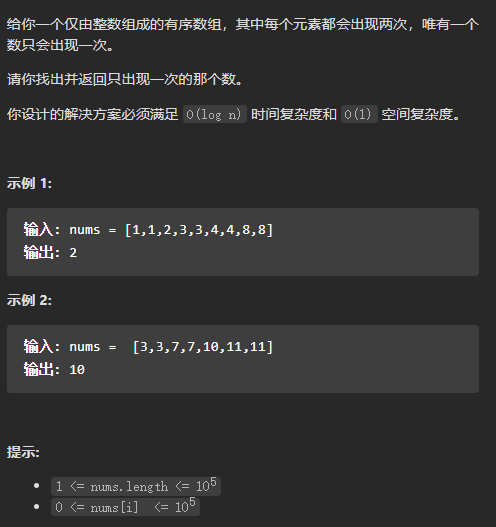

**数组特征** ： 
 - 只出现一次的那个数**不在中间点左边就在中间点右边**
 - 对于目标元素出现之前的数组序列中，元素与其下标之间满足的关系为`nums[idx]==nums[idx^1]`, 设为==条件A==。
 - 满足条件A-->在中间点右边查找；不满足条件A-->在中间点左边查找


## [81. 搜索旋转排序数组 II](https://leetcode-cn.com/problems/search-in-rotated-sorted-array-ii/)

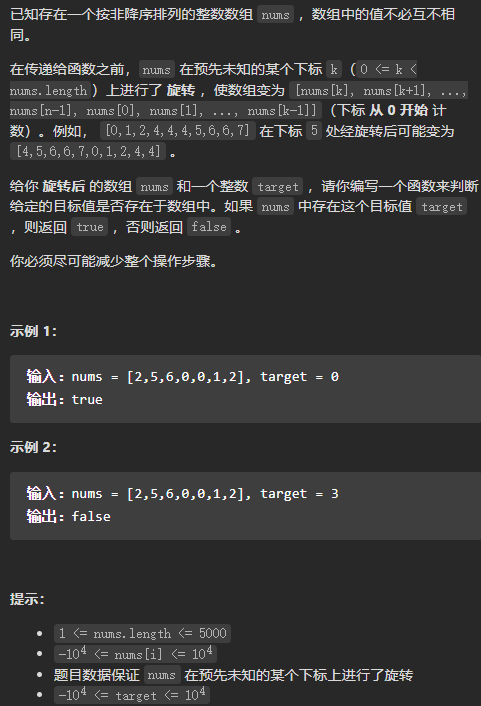

**数据去重**：一开始首末两端的数据会出现相同的情况，这时只需要将右端点元素往左移一位即可。

**条件A**：`nums[mid] <= nums[right]`表明右段数据非递减有序；反之则左段数据非递减有序。**在此基础上**将$target$与$nums[mid]$和$nums[right]$比较即可得到下一步查找的数据段范围。

## [719.找出第K小的对数距离](https://leetcode.cn/problems/find-k-th-smallest-pair-distance/)


**特殊处理**：
1. 使用二分法在  $ 0 - 最大差值 $ 之间确定差值$mid$
2. 统计 $mid$ 在nums[]数组中满足数对的个数，依次相加，时间代价平均每次为 $o(nums.size())$

```c++
class Solution {
public:
    int smallestDistancePair(vector<int>& nums, int k) {
        sort(nums.begin(), nums.end());
        int n_size = (int)nums.size();

        int le = 0;
        int ri = nums[n_size - 1] - nums[0];
        while(le <= ri){
            int mid = (le + ri) >> 1;

            int cnt = 0;

            for(int j = 1; j < n_size; ++j){
                int i = lower_bound(nums.begin(), nums.begin() + j, nums[j] - mid) - nums.begin();
                cnt += j - i;
            }


            if(cnt >= k){
                ri = mid - 1;
            }else{
                le = mid + 1;
            }
        }

        return le;
    }
};
```


# 十二。 动态规划专题


## 0-1背包问题

### 物品只有**一个维度**的重量属性

[416.分割子集](https://leetcode-cn.com/problems/partition-equal-subset-sum/)

物品的**重量**即为数组中的每个数值，而**价值**则为==是否能够平均分配==这样一个状态属性。

```c++
class Solution {
public:
    bool canPartition(vector<int>& nums) {
        int target = 0;
        for(auto& tar : nums)
        {
            target += tar;
        }

        //无法平均分成两份则必为false
        if(target % 2) return false;

        //0-1背包问题
        target /= 2;
        vector<bool> dp(target + 1 , false);
        dp[0] = true;

        for(int i = 1 ; i <= nums.size() ; ++i)
        {
            int w = nums[i-1];
            for(int j = target ; j >= w ; --j)
            {
                dp[j] = dp[j-w] || dp[j];
            }
        }
        return dp[target];
    }
};
```

### 物品包含**多个维度**的重量属性

 [474.一和零](https://leetcode-cn.com/problems/ones-and-zeroes/)

物品的**重量**属性拥有多个，属于多维度01背包问题。这一题中物品的重量对应为**每个字符串中包含的0和1字符的个数**，因此最简形式的 **==空间复杂度==** 为二维矩阵（从三维矩阵压缩而来）。

```c++
class Solution {
public:
    int findMaxForm(vector<string>& strs, int m, int n) {
        int len = strs.size();
        vector<vector<int>> dp(m+1,vector<int>(n+1,0));
        for(string cur : strs)
        {
            //统计当前}“物品”的两个维度的“重量”，也就是0和1的个数
            int zeroCnt = 0, oneCnt = 0;
            for(char tmp : cur)
            {
                if(tmp=='1') oneCnt++;
                else zeroCnt++;
            }

            //三维空间复杂度压缩至二维空间复杂度下的逆向遍历求解
            for(int i = m ; i >= zeroCnt ; --i)
            {
                for(int j = n ; j >= oneCnt ; --j)
                {
                    dp[i][j] = dp[i-zeroCnt][j-oneCnt] + 1 > dp[i][j] ? dp[i-zeroCnt][j-oneCnt] + 1:dp[i][j];
                }
            }
        }
        return dp[m][n];
    }
};
```

## 完全背包问题

## 字符串序列DP问题

**[650.只有两个键的键盘](https://leetcode.cn/problems/2-keys-keyboard/submissions/)**

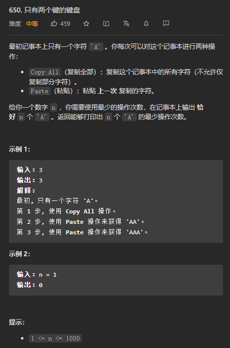

时间复杂度：$o(n^2)$        

空间复杂度：$o(n)$

```c++
class Solution {
public:
    int minSteps(int n) {
        if(n == 1) return 0;
        vector<int> dp(n + 1, 0);
        for(int i = 1 ; i <= n ; ++i){
            dp[i] = i;
        }

        dp[1] = 0;
        for(int i = 2 ; i <= n ; ++i){
            for(int j = 1; j * j <= i ; ++j){
                if(i % j == 0){
                    //分两步：
                    //第一步————从初始状态转移到j个A需要的步数为dp[j]；
                    //第二部————从j个A转移到i个A需要的步数为dp[i/j]；（也就是把j个A看成一个整体同时复制）
                    dp[i] = (dp[i / j] + dp[j]) < dp[i] ? (dp[i / j] + dp[j]) : dp[i];
                }
                
            }
        }
        return dp[n];
    }
};
```

# 十三。 蓄水池抽样算法

大数据工程师

## 适用场景

数据量 ==N== 很大（远超内存空间），需要**一次遍历**（时间复杂度o(N)）之后直接得到 ==k== 个随机抽取的数据。

使得**在没有获得全部数据之前**每个数据被抽中的概率随着输入数据的增多，保持相同的被抽中概率。

## 伪代码描述

```c++
//Init : a reservoir with the size = k
//Init : datastream with the size = N (N >> k)

//put first k data into the reservoir
for(int i = 0 ; i < k ; i++)
{
    reservoir[i] = datastream[i];
}

//from k+1 to N , switch the i_th data with the d_th data in the reservoir
for(int i = k ; i < N ; ++i)
{
    //the i+1_th data has the probability of 1/i+1 to be chosen to swap
    int d = rand() % (i + 1);
    if(d < k){
        swap(reservoir[d] , datastream[i]);
    }
}
```

## 概念证明

证明该算法使得**在没有获得全部数据之前**每个数据被抽中的概率随着输入数据的增多，保持相同的被抽中概率。

$第i个数据被选中的概率 = 第i个数据最终留在reservoir中的概率 = 第i个数据进入reservoir的概率 \times 选择后续第i+1个 ～ 第N个数据时第i个数据不被替换出去的概率$ 

其中 

$ 选择第i+1个数据时第i个数据不被替换出去概率 = 未选中第i+1个数据的概率 + 选中第i+1个数据但没有替换的概率 $

也就是

$\frac{k}{i} \times (1 - \frac{k}{i+1}) + \frac{k}{i} \times (\frac{k}{i+1} \times (1 - \frac{1}{k})) = \frac{k}{i+1}$

# 十四。 字符串问题

## KMP字符串匹配算法

**STEP 1. 生成模式串P的next[]数组**

在KMP字符串匹配算法时，默认所有的字符串**下标从1开始**。

```c++
//len为模式串长度
void initNext(int& len) {
    for(int i = 2, j = 0; i <= len; ++i) {
        //找到下标i 之前的不同值
        while(j && P[i] != P[j + 1]) j = ne[j];
        //找到最长匹配的前缀
        if(P[i] == P[j + 1]) ++j;
        ne[i] = j;
    }
}
```

**STEP 2. 将模式串P与字符串S进行匹配**

```C++
bool checkString(int& s_len, int& p_len) {
    for(int i = 1, j = 0; i <= s_len; ++i) {
        while(j != 0 && S[i] != P[j + 1]) j = ne[j];

        //找到最长匹配的前缀
        if(S[i] == P[j + 1]) ++j;

        if(j == p_len) {
            ///输出
        }
    }
}
```

## 连续字符子串问题

求 **==连续==字符子串**问题时可以使用**滑动窗口**或者**双指针**两个技巧求解，在遍历字符序列的过程中用**哈希表**来存储。记录，每个字符or字符串的**出现次数**。

### [438.找到字符串中所有字母异位词](https://leetcode.cn/problems/find-all-anagrams-in-a-string/)

使用**双指针**依次遍历

```c++
class Solution {
public:
    vector<int> findAnagrams(string s, string p) {
        int sLen = s.size(), pLen = p.size();

        if (sLen < pLen) {
            return vector<int>();
        }

        vector<int> ans;
        vector<int> sCount(26);
        vector<int> pCount(26);
        for (int i = 0; i < pLen; ++i) {
            ++sCount[s[i] - 'a'];
            ++pCount[p[i] - 'a'];
        }

        if (sCount == pCount) {
            ans.emplace_back(0);
        }

        //双指针遍历字符串，i弹出，j压入
        int i = 0;
        int j = pLen;

        while(j < sLen) {
            //i位置弹出
            --sCount[s[i] - 'a'];
            //j位置压入
            ++sCount[s[i + pLen] - 'a'];

            //每前进一次就进行判断
            if (sCount == pCount) {
                ans.emplace_back(i + 1);
            }
        }

        return ans;
    }
};

作者：LeetCode-Solution
链接：https://leetcode.cn/problems/find-all-anagrams-in-a-string/solution/zhao-dao-zi-fu-chuan-zhong-suo-you-zi-mu-xzin/
来源：力扣（LeetCode）
著作权归作者所有。商业转载请联系作者获得授权，非商业转载请注明出处。
};
```


### [30. 串联所有单词的子串](https://leetcode.cn/problems/substring-with-concatenation-of-all-words/)

使用**滑动窗口**方法：
```c++
class Solution {
private:
    vector<int> ans;
public:
    vector<int> findSubstring(string s, vector<string>& words) {
        int single_len = (int)words[0].length();
        int words_cnt = (int)words.size();
        int total_len = words_cnt * single_len;
        int s_len = (int)s.length();
        


        if(s_len < total_len) return ans;
        
        unordered_map<string, int> total_mp;
        for(auto& s : words) {
            total_mp[s]++;
        }

        int tmp_cnt = 0;
        bool flag = false;
        unordered_map<string, int> tmp_mp;
        for(int i = 0; i <= s_len - total_len; ++i) {
            tmp_mp.clear();
            tmp_cnt = 0;
            flag = false;

            for(int j = i; j < total_len + i; j = j + single_len) {
                string t = s.substr(j, single_len);
                if(total_mp[t] == 0) {
                    flag = true;
                    break;
                }

                tmp_mp[t]++;
                tmp_cnt++;

                if(tmp_mp[t] > total_mp[t] || tmp_cnt > words_cnt) {
                    flag = true;
                    break;
                }
            }
            if(tmp_cnt != words_cnt) {
                flag = true;
            }

            if(!flag) {
                ans.push_back(i);
            }else {
                continue;
            }
        }

        return ans;
    }
};
```

##  Trie树（字典树）

**字典树简介：** 树形结构，其中根节点不存储任何数据，其任意非根节点包括==数据域==和==指针域==两个部分，==数据域==指示以当前元素为查找序列的末尾元素的序列内容（或者全部序列个数）；==指针域==指向下一个元素节点。

**典型应用：** 典型应用是用于统计和排序大量的字符串（但不仅限于字符串），所以经常被**搜索引擎**系统用于**文本词频统计**。它的优点是最大限度地减少无谓的字符串比较，查询效率比较高。

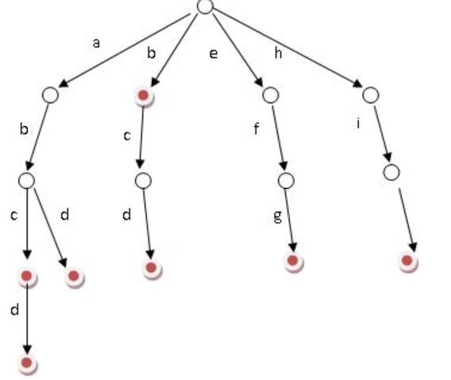

### Trie树模板

```c++
//1. define the node of TrieTREE
class Trie {
private:
    typedef struct node {
        int cnt;
        struct node *next[26];      //pointer to next char;
        node() {cnt = 0; memset(next, 0, sizeof(next));};
    }NODE;

    NODE *root;
    
public:
    Trie() {
        root = new NODE();
    }
    
    void insert(string word) {
        NODE *ptr = root;
        for(auto& c : word) {
            if(ptr->next[c - 'a'] == NULL) {
                NODE *cur = new NODE();
                ptr->next[c - 'a'] = cur;
                ptr = cur;
            }else {
                ptr = ptr->next[c - 'a'];
            }
        }
        ptr->cnt++;
    }
    
    bool search(string word) {
        NODE *ptr = root;
        for(auto& c : word) {
            if(ptr->next[c - 'a'] == NULL) return false;
            else {
                ptr = ptr->next[c - 'a'];
            }
        }

        if(ptr->cnt == 0) return false;
        else return true;
    }
    
    bool startsWith(string prefix) {
        NODE *ptr = root;
        for(auto& c : prefix) {
            if(ptr->next[c - 'a'] == NULL) return false;
            else {
                ptr = ptr->next[c - 'a'];
            }
        }


        if(ptr->cnt != 0) return true;
        for(int i = 0; i < 26; ++i) {
            if(ptr->next[i] != NULL) return true;
        }
        return false;
    }
};

/**
 * Your Trie object will be instantiated and called as such:
 * Trie* obj = new Trie();
 * obj->insert(word);
 * bool param_2 = obj->search(word);
 * bool param_3 = obj->startsWith(prefix);
 */
```


# 十五。 树的Morris中序遍历算法

## 算法特征

使用$o(n)$的时间复杂度和o(1)的**空间复杂度**对树完成遍历。

利用了树节点中大量的**空孩子指针**来指示当前遍历模式的**前驱节点**，并在使用后 ==将原来的空指针恢复，保证树不变==。

## 算法语言描述

对于当前的节点root，若root非空则进行以下操作：

1. 若root->left为空，则root = root->right；

2. 若root->left非空：

    设root左子树中 **最右侧** 节点为mostRi，如果
    
    1. mostRi->right为空，则将mostRi的右孩子指针指向root（找到直接前驱），并令root = root->left；

    2. mostRi->right非空，则此时**右孩子节点一定指向root**，先**进行遍历操作**，之后将root = root->right（回到当前节点的直接后继），并将mostRi右孩子节点还原为NULL；


## 算法应用

[剑指offer II.054  树节点中大于等于当前节点值的和](https://leetcode-cn.com/problems/w6cpku/)

```c++
/**
 * Definition for a binary tree node.
 * struct TreeNode {
 *     int val;
 *     TreeNode *left;
 *     TreeNode *right;
 *     TreeNode() : val(0), left(nullptr), right(nullptr) {}
 *     TreeNode(int x) : val(x), left(nullptr), right(nullptr) {}
 *     TreeNode(int x, TreeNode *left, TreeNode *right) : val(x), left(left), right(right) {}
 * };
 */
class Solution {
private:
    TreeNode* findNext(TreeNode* root) {
        TreeNode* succ = root->right;
        while(succ != NULL && succ->left != NULL && succ->left != root) {
            succ = succ->left;
        }
        return succ;
    }
public:
    TreeNode* convertBST(TreeNode* root) {
        TreeNode* ret = root;
        int sum = 0;
        while(ret != NULL) {
            if(ret->right == NULL) {
                sum += ret->val;
                ret->val = sum;
                ret = ret->left;
            }else {
                TreeNode* succ = findNext(ret);
                if(succ->left == NULL) {
                    succ->left = ret;
                    ret = ret->right;
                }else {
                    succ->left = NULL;
                    sum += ret->val;
                    ret->val = sum;
                    ret = ret->left;
                }
            }
        }

        return root;
        
    }
};
```


# 十六。 动态规划专题

## 字符串匹配DP解决

[392.判断子序列](https://leetcode.cn/problems/is-subsequence/submissions/)


**DP思路：**
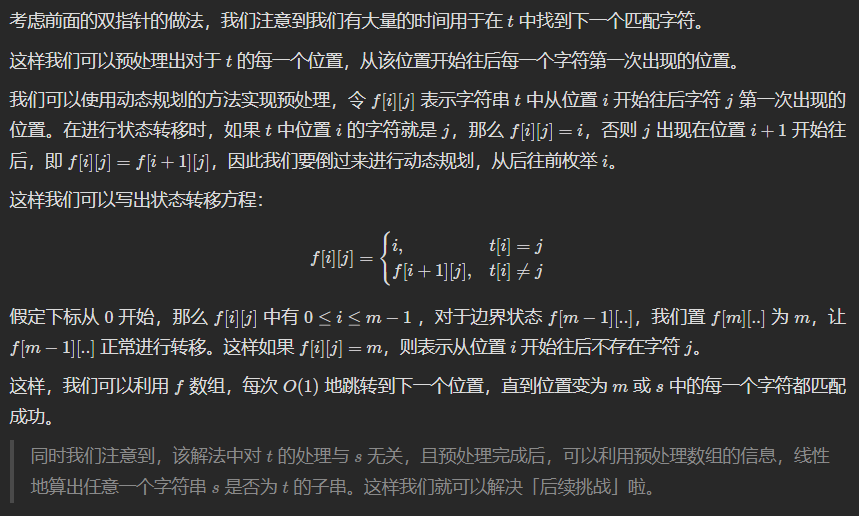

```c++
class Solution {
public:
    bool isSubsequence(string s, string t) {
        int n = (int)s.length();
        int m = (int)t.length();
        vector<vector<int>> dp(m + 1, vector<int>(26, m));


        //从后向前遍历，确定从位置i开始，字符j在i之后第一次出现的下标
        for(int i = m - 1; i >= 0; --i) {
            for(int j = 0; j < 26; ++j) {
                if(t[i] == (char)(j + 'a')) {
                    dp[i][j] = i;
                }else {
                    dp[i][j] = dp[i + 1][j];
                }
            }
        }

        int ptr = 0;
        for(auto& c : s) {
            if(dp[ptr][c - 'a'] == m) return false;
            ptr = dp[ptr][c - 'a'] + 1;
        }
        return true;
    }
};
```


# 写题时遇到的一些细节问题

# DFS遍历局部变量的设置

每层的变量应当设置在DFS方法内部，**不可以在DFS方法外初始化**，因为编译器会优化代码，将后续多个DFS展开为 ==并行运算==

[576. 出界的路径数](https://leetcode.cn/problems/out-of-boundary-paths/)