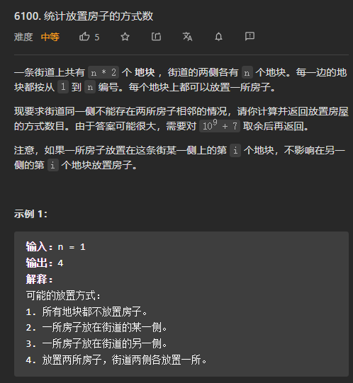
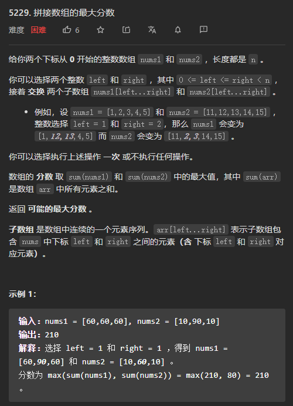

# 第299场周赛

## [6100.统计放置房子的方式个数](https://leetcode.cn/problems/count-number-of-ways-to-place-houses/)



**思路**：周赛当中经常会考**动态规划**的问题，因此首先考虑DP的解法。

1. **状态是如何转移的**？先考虑第i个地块（i从1开始），**第i个地块上<u>放置房屋与否</u>取决于<u>第i - 1个地块（也就是前面的地块）是否有放置房屋</u>**。也就是说==前面的区位总共有两种不同的可能情况==。
2. 引入两个数组pre_fix[]和pre_unfix[]，前者表示<u>满足题目条件的情况下</u>第pos个区位**安放房屋**的情况之和；后者表示<u>满足题目条件的情况下</u>第pos个区位**不安放房屋**的情况之和。
3. 第pos个区位满足条件的情况之和为**pre_fix[pos] + pre_unfix[pos]**。
4. 以上就可以求出街道某一边的满足要求的房屋放置情况总和。因为**街道两边放置房屋互不影响**，因此返回**平方值**即可。

**核心问题**：需要知道当前区位前一区位的房屋放置情况，因此建立对应的dp数组。

```c++
class Solution {
public:
    const int MOD = 1e9 + 7;
    int countHousePlacements(int n) {
        vector<int> pre_fix(n + 1, 0);
        vector<int> pre_unfix(n + 1, 0);
        
        pre_unfix[0] = 1;
        for(int i = 1; i <= n ; ++i) {
            pre_unfix[i] = ((pre_fix[i - 1]) % MOD + (pre_unfix[i - 1]) % MOD) % MOD;
            pre_fix[i] = pre_unfix[i - 1] % MOD;
        }
        
        long long a = pre_unfix[n];
        long long b = pre_fix[n];
        
        long long ans = (((a + b) % MOD) * ((a + b) % MOD)) % MOD;
        //cout<<ans<<"    "<<bitset<64>(ans)<<endl;
        
        return (int)ans;
        
        
    }
};
```

## [5229.拼接数组的最大分数](https://leetcode.cn/problems/maximum-score-of-spliced-array/)



**核心问题**：找到**对方数组**的最大值进行替换，因此需要知道对应区间的**最大差值**，建立与差值有关的dp数组。

1. **状态是如何转移的**？考虑将nums1[]的pos位置之前的某一子序列换为nums2[]中子序列，如果此次置换能提高nums1[]的总和，则记录下来；否则跳过，继续遍历下一个位置。
2. 因此我们需要建立的dp[]数组为差值数组，其中offset1[pos]保存的是将nums1[]的pos位置之前的某一子序列换为nums2[]中子序列之后所能获得的**最大增益**，不得小于0；如果增益小于零则**强制设置为0**，表明==以pos点为最远端进行的置换不会出现增益==。

```c++
class Solution {
public:
    int maximumsSplicedArray(vector<int>& nums1, vector<int>& nums2) {
        int size = (int)nums1.size();
        vector<int> offset1(size, 0);   
        vector<int> offset2(size, 0);
        for(int i = 0 ; i < size ; ++i) {
            offset1[i] = nums2[i] - nums1[i];
            offset2[i] = nums1[i] - nums2[i];
        }

        int sums1 = accumulate(nums1.begin(), nums1.end(), 0);
        int sums2 = accumulate(nums2.begin(), nums2.end(), 0);
        int cur_max = 0;
        int max1 = 0;
        int max2 = 0;
        for(int i = 0; i < size; ++i) {
            cur_max += offset1[i];
            if(cur_max < 0) cur_max = 0;
            max1 = max1 < cur_max ? cur_max : max1;
        }

        cur_max = 0;

        for(int i = 0; i < size ; ++i) {
            cur_max += offset2[i];
            if(cur_max < 0) cur_max = 0;
            max2 = max2 < cur_max ? cur_max : max2;
        }

        return sums1 + max1 > sums2 + max2 ? sums1 + max1 : sums2 + max2;
    }
};
```