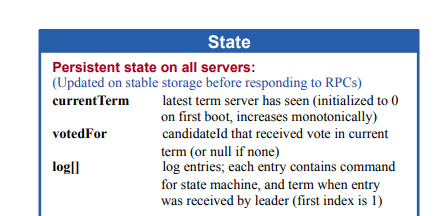
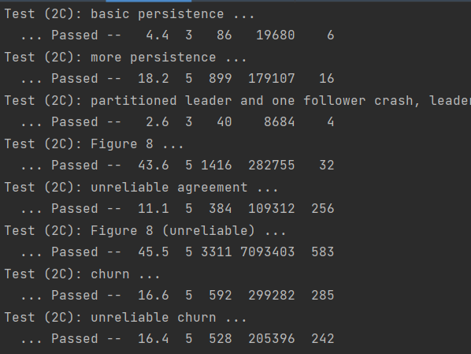
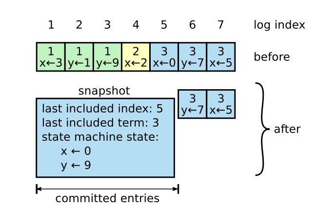

# 目录

<!-- @import "[TOC]" {cmd="toc" depthFrom=1 depthTo=6 orderedList=false} -->

<!-- code_chunk_output -->

- [目录](#目录)
- [1 实验概述](#1-实验概述)
- [2 实验步骤](#2-实验步骤)
  - [2.1 实现持久化编码解码的方法](#21-实现持久化编码解码的方法)
  - [2.2 RAFT节点状态持久化编码与解码的位置](#22-raft节点状态持久化编码与解码的位置)
- [3 实验中遇到的问题](#3-实验中遇到的问题)
- [4 实验结果](#4-实验结果)
- [5 日志压缩](#5-日志压缩)
  - [5.1 为什么需要日志压缩 Log Compaction](#51-为什么需要日志压缩-log-compaction)
  - [5.2 Snapshot](#52-snapshot)
    - [5.2.1 实现方式](#521-实现方式)
    - [5.2.2 AppendEntries结构体更新](#522-appendentries结构体更新)

<!-- /code_chunk_output -->


# 1 实验概述

&emsp;&emsp;本次实验实现了RAFT节点状态的持久化presist，通过`labgob`库来实现状态的持久化编码。其目的是为了能在系统的RAFT节点在宕机或者失效之后能够及时恢复成失效前的有效状态。

&emsp;&emsp;在完成了RAFT节点状态的持久化编码后，将函数`persist()`与`readPersist()`插入需要进行状态持久化或者读取的位置。

# 2 实验步骤

## 2.1 实现持久化编码解码的方法

&emsp;&emsp;需要进行持久化的RAFT节点状态在论文中已经给出，如下所示：


&emsp;&emsp;代码实现如下：
```go
// save Raft's persistent status to stable storage,
// where it can later be retrieved after a crash and restart.
// see paper's Figure 2 for a description of what should be persistent.
//
func (rf *Raft) persistData() []byte {
	// Your code here (2C).
	// Example:
	w := new(bytes.Buffer)
	e := labgob.NewEncoder(w)
	e.Encode(rf.currentTerm)
	e.Encode(rf.votedFor)
	e.Encode(rf.logs)
	e.Encode(rf.lastIncludeIndex)
	e.Encode(rf.lastIncludeTerm)
	data := w.Bytes()
	//fmt.Printf("RaftNode[%d] persist starts, currentTerm[%d] voteFor[%d] log[%v]\n", rf.me, rf.currentTerm, rf.votedFor, rf.logs)
	return data
}

func (rf *Raft) persist() {
	data := rf.persistData()
	rf.persister.SaveRaftState(data)
}

//
// restore previously persisted status.
//
func (rf *Raft) readPersist(data []byte) {
	if data == nil || len(data) < 1 { // bootstrap without any status?
		return
	}
	// Your code here (2C).
	// Example:
	r := bytes.NewBuffer(data)
	d := labgob.NewDecoder(r)
	var currentTerm int
	var votedFor int
	var logs []LogEntry
	var lastIncludeIndex int
	var lastIncludeTerm int
	if d.Decode(&currentTerm) != nil ||
		d.Decode(&votedFor) != nil ||
		d.Decode(&logs) != nil ||
		d.Decode(&lastIncludeIndex) != nil ||
		d.Decode(&lastIncludeTerm) != nil {
		fmt.Println("decode error")
	} else {
		rf.currentTerm = currentTerm
		rf.votedFor = votedFor
		rf.logs = logs
		rf.lastIncludeIndex = lastIncludeIndex
		rf.lastIncludeTerm = lastIncludeTerm
	}
}
```

## 2.2 RAFT节点状态持久化编码与解码的位置

&emsp;&emsp;一旦节点的状态发生改变，则必然需要进行节点状态参数的持久化操作。

&emsp;&emsp;在初始化RAFT节点，LEADER ELECTION，RequestVote RPC调用以及LEADER AppendEntries RPC调用时都需要进行状态参数持久化的操作。

# 3 实验中遇到的问题

&emsp;&emsp;在实现Lab2C之前，raft中进程使用的是select来进行异步。但是发现select其实会有很多隐性的阻塞、死锁问题、资源泄露问题，且对于多个ticker竞争之间，不仅会导致代码可读性变差，也可能会导致时间过长test失败。在打印日志后发现没通过的test地方，最后一直在send a election，发现后是两个rf节点一直没收到另外一个节点的回复。然后两个节点各自持有一票，导致无法选举出来，一查那个节点卡在了apply chan部分，最后追根溯源就发现锁一直持有在发送ticker的select的地方。对于这个部分就是后面对整体的ticker进行了修改，分离出了提交日志、选举日志、日志增量三个ticker。

&emsp;&emsp;Lab2C与Lab2B的实现冲突：Lab2C的figure8以及Lab2B的RPC counts aren’t too high之间如果想要兼容，一定要注意三个ticker之间的休眠时间，进行协调，如果协调不一致，很容易导致原本就不好过的test直接失败，又或者一个通过另一个失败。


# 4 实验结果

&emsp;&emsp;

# 5 日志压缩

## 5.1 为什么需要日志压缩 Log Compaction

&emsp;&emsp;Raft 的日志在正常运行时会增长，以容纳更多的客户端请求，但在实际系统中，它不能无限制地增长。 随着日志变长，它会占用更多空间并需要更多时间来重播。 如果没有某种机制来丢弃日志中积累的过时信息，这最终会导致可用性问题。
也因此我们使用Snapshot（快照）来简单的实现日志压缩。

## 5.2 Snapshot

### 5.2.1 实现方式



&emsp;&emsp;假设现在log中存储了x、y的更新信息。x的更新信息依次是3、2、0、5。y的更新信息依次是1、9、7。且日志下标1~5的日志被commit了，说明这段日志已经不再需要对当前节点来说已经不再需要。那么我们就存取这段日志的最后存储信息当做日志也就是x=0，y=9的时候并记录最后的快照存储的日志下标（last included index）以及其对应的任期。此时我们新的日志就只需要6、7未提交的部分，log的长度也从7变为了2。

&emsp;&emsp;也因此可以看出快照存储是根据raft节点的个数决定。每个节点都会存取自身的快照，快照的信息就相当于commit过后的日志。

### 5.2.2 AppendEntries结构体更新

&emsp;&emsp;回到RAFT的日志增量中，其实我们可以发现，commit更新的流程其实是，LEADER发送给各个节点进行同步日志，然后返回给LEADER同步RPC的结果，更新`matchIndex`。如果超过半数节点已经同步成功后的日志，那么LEADER会把超过半数，且最新的`matchIndex`设为`commitIndex`,然后再由提交ticker进行提交。然后在下一次发送日志心跳时再更新其他SERVER的`commitIndex`下标。


&emsp;&emsp;也因此就会可能有半数的节点，又或是网络分区，失效的节点没有更新到已提交的节点，而这段已提交的日志已经被LEADER提交而抛弃了。那么这个时候就需要LEADER发送自身的快照，安装给这些SERVER。