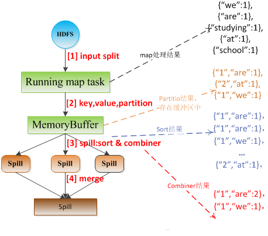
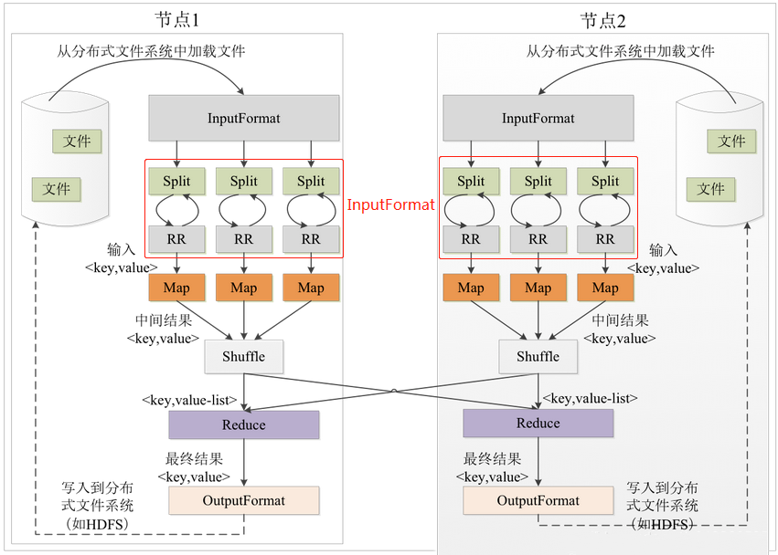

# MapReduce

## MapReduce的产生背景

Google 在2004年的时候在 [MapReduce: Simplified Data Processing on Large Clusters](https://static.googleusercontent.com/media/research.google.com/zh-CN//archive/mapreduce-osdi04.pdf) 这篇论文中提出了MapReduce 的功能特性和设计理念，设计MapReduce 的出发点就是为了解决如何把大问题分解成独立的小问题，再并行解决。例如，MapReduce的经典使用场景之一就是对一篇长文进行词频统计，统计过程就是先把文章分为一句一句，然后进行分割，最后进行词的数量统计。

## MapReduce的核心思想

MapReduce是一个分布式运算程序的编程框架，是用户开发“基于 hadoop 的数据分析 应用”的核心框架。用户可以基于该框架轻松的编写应用程序，而这些应用程序能够运行在由上千个商用服务器组成的大集群上，并以一种可靠的，具有高容错能力的方式并行处理上TB级别的海量数据集。

MapReduce的特征可以概括为以下六点：

1. 将复杂的、运行于大规模集群上的并行计算过程高度地抽象到了两个函数：Map和Reduce中。

2. 编程容易，开发人员不需要掌握分布式并行编程细节，也可以很容易的把自己的程序运行在分布式系统上，然后完成海量计算。

3. MapReduce采用“分而治之”的策略，一个存储在分布式文件系统中的大规模数据集，会被切分成许多独立的分片（split），这些分片可以被多个Map任务并行处理

4. MapReduce设计的理念就是“计算向数据靠拢”，而不是“数据向计算靠拢”，这样就减少了大量的网络传输开销。

5. MapReduce框架采用了Coordinator/Worker架构，包括一个Coordinator和若干个Worker，两者之间通过RPC中Task的Args与Reply交换信息。

6. Hadoop框架使用java实现的，但是，MapReduce应用程序则不一定要有java来写。

## MapReduce的运行概述

首先是客户端client要编写好mapreduce程序，配置好mapreduce的作业也就是job，接下来就是启动job了，启动job是告知JobTracker上要运行作业，这个时候JobTracker就会返回给客户端一个新的job任务的ID值，接下来它会做检查操作，这个检查就是确定输出目录是否存在，如果存在那么job就不能正常运行下去，JobTracker会抛出错误给客户端，接下来还要检查输入目录是否存在，如果不存在同样抛出错误，如果存在JobTracker会根据输入计算输入分片（Input Split），如果分片计算不出来也会抛出错误，这些都做好了JobTracker就会配置Job需要的资源了。拿到jobID后，将运行作业所需要的资源文件复制到HDFS上，包括MapReduce程序打包的JAR文件、配置文件和计算所得的输入分片信息。这些文件都存放在jobTracker专门为该作业创建的文件夹中，文件夹名为该作业的Job ID。JAR文件默认会有10个副本(mapred.submit.replication属性控制)；输入分片信息告诉 JobTracker应该为这个作业启动多少个map任务等信息。当资源文件夹创建完毕后，客户端会提交job告知jobTracker我已将所需资源写入hdfs上，接下来请你帮我真正去执行job。

分配好资源后，JobTracker接收提交job请求后就会初始化作业，初始化主要做的是将Job放入一个内部的队列，等待作业调度器对其进行调度。当作业调度器根据自己的调度算法调度到该作业时，作业调度器会创建一个正在运行的job对象（封装任务和记录信息），以便JobTracker跟踪job的状态和进程。创建job对象时作业调度器会获取hdfs文件夹中的输入分片信息，根据分片信息为每个input split创建一个map任务，并将map任务分配给tasktracker执行。对于map和reduce任务，tasktracker根据主机核的数量和内存的大小有固定数量的map槽和reduce槽。这里需要强调的是：map任务不是随随便便地分配给某个tasktracker的，这里涉及到后面要讲的数据本地化。
接下来就是任务分配了，这个时候tasktracker会运行一个简单的循环机制定期发送心跳给jobtracker，心跳间隔是5秒，程序员可以配置这个时间，心跳就是jobtracker和tasktracker沟通的桥梁，通过心跳，jobtracker可以监控tasktracker是否存活，也可以获取tasktracker处理的状态和问题，同时tasktracker也可以通过心跳里的返回值获取jobtracker给它的操作指令。tasktracker会获取运行job所需的资源，比如代码等，为真正执行做准备。

任务分配好后就是执行任务了。在任务执行时候jobtracker可以通过心跳机制监控tasktracker的状态和进度，同时也能计算出整个job的状态和进度，而tasktracker也可以本地监控自己的状态和进度。TaskTracker每隔一段时间会给JobTracker发送一个心跳，告诉JobTracker它依然在运行，同时心跳中还携带者很多的信息，比如当前map任务完成的进度等信息。当jobtracker获得了最后一个完成指定任务的tasktracker操作成功的通知时候，jobtracker会把整个job状态置为成功，然后当客户端查询job运行状态时候（注意：这个是异步操作），客户端会查到job完成的通知的。如果job中途失败，mapreduce也会有相应机制处理，一般而言如果不是程序员程序本身有bug，mapreduce错误处理机制都能保证提交的job能正常完成。

## MapReduce的应用场景

MapReduce 的产生是为了把某些大的问题分解成小的问题，然后解决小问题后，大问题也就解决了。那么一般有什么样的场景会运用到这个呢？那可多了去，简单地列举几个经典的场景。

### 1. 计算URL的访问频率

搜索引擎的使用中，会遇到大量的URL的访问，所以，可以使用 MapReduce 来进行统计，得出（URL,次数）结果，在后续的分析中可以使用。

### 2. 倒排索引

Map函数去分析文件格式是（词，文档号）的列表，Reduce 函数就分析这个（词，文档号），排序所有的文档号，输出（词，list（文档号）），这个就可以形成一个简单的倒排索引，是一种简单的算法跟踪词在文档中的位置。

### 3. Top K 问题

在各种的文档分析，或者是不同的场景中，经常会遇到关于 Top K 的问题，例如输出这篇文章的出现前5个最多的词汇。这个时候也可以使用 MapReduce来进行统计。

# RAFT共识算法

## RAFT背景

Raft 是⼀种为了管理复制⽇志的⼀致性算法。或者说共识算法，让⼀组机器像⼀个整体⼀样⼯作，即使其中⼀些机器出现故障也能够继续⼯作。它将⼀致性算法分解成了⼏个关键模块：领导⼈选举、⽇志复制和安全性。同时它通过更强的⼀致性来减少状态机的数量。总之，对比传统的一致性算法 Paxos，Raft 更清晰易懂，易于实现。

### RAFT的特性

- 强领导者：例如⽇志条⽬只从领导者发送给其他的服务器，简化了对复制⽇志的管理并好理解。
- 领导选举：用随机计时器来选举领导者，基于心跳机制实现，用于解决冲突。
- 成员关系调整：使得集群在成员变换的时候依然可以继续⼯作。

## 状态机的复制

一致性算法基于复制状态机。⼤规模的系统中通常都有⼀个集群领导者（Primary，论文中用的 Leader），⼀个独⽴的的复制状态机管理领导选举和存储配置信息并且在领导⼈宕机的情况下存活下来。在之前 VMware FT 中已经学过这个，复制状态机通常都是基于复制⽇志实现。日志传递 Primary 所有操作记录，让所有 Backup 执行相同的指令序列，达到相同的状态。

### 一致性算法特征

- 安全性：非拜占庭错误情况下，绝不会返回错误的结果
- 可用性：只要大多数机器正常就可保证可用。
- 不依赖时序保证一致性
- 一条指令大多数节点可一轮 RPC 完成，小部分慢节点不影响整体性能。

## RAFT共识算法

Raft 是⼀种⽤来管理第 2 部分中描述的复制⽇志的算法。图2是这个算法的简略版，图3列举了这个算法的关键特性。

Raft 选举一个 Leader，给予管理所有复制日志的权限，由此实现一致性。

Leader 从客户接受指令，写入日志，复制到其他 Backup Server 上，在保证安全性时通知其他 Server 根据日志执行指令更新状态机。

Leader 大大简化了对复制日志的管理。leader 可以自行决定新日志写入位置，数据都从 Leader 流向其他 Server。当 Leader 宕机，其他 Server 中选举一个新 Leader。

由此 Raft 将一致性问题分解为三个子问题：

- 领导选举：旧 Leader 宕机选举新 Leader 
- 日志复制：Leader 接受日志，复制到其他节点并保证一致。
- 安全性：关键在于状态机安全：某一节点应用某个日志条目到状态机，其他节点不能在此条目应用不同指令。
  
此处还涉及一个额外的选举机制上的限制